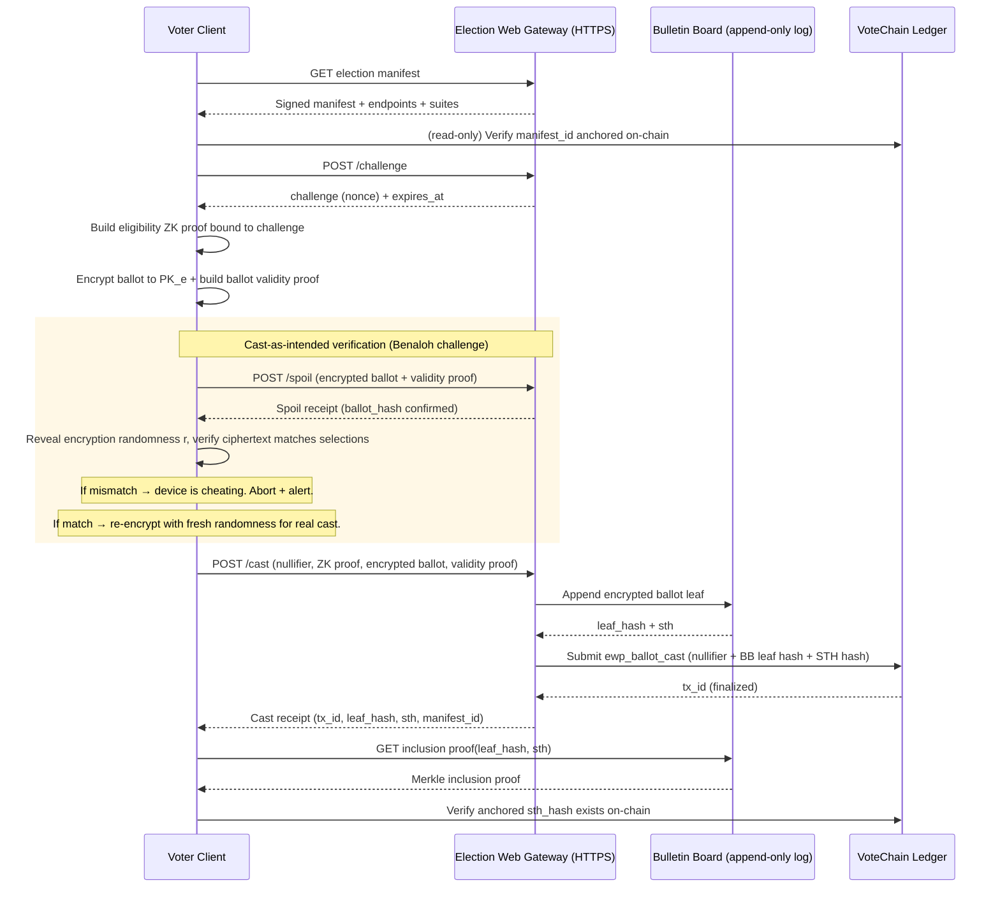

# PRD: VoteChain Election Web Protocol (EWP) — Ballot Integrity Protocol

> **Status:** Preview / Draft (EWP/0.1)
>
> **Date:** 2026-02-08
>
> **Scope:** End-to-end ballot integrity layer that completes **VoteChain** voter verification — the cryptographic chain of custody from cast to tally.
>
> **Non-claim:** This document is not an endorsement of immediate nationwide unsupervised Internet voting. It is a buildable protocol for ensuring every ballot — whether cast at a polling place, a supervised kiosk, or (with appropriate gating) a remote device — is encrypted, recorded, included, and counted correctly. Intended for controlled pilots, red teaming, and standards work (NIST/EAC/CISA + external review).

## 0. Relationship To The VoteChain PRD

This protocol **completes** the VoteChain blueprint defined in `PRD-VOTER-VERIFICATION-CHAIN.md`.

VoteChain answers four questions and records verification events on a permissioned ledger:

1. Citizen?
2. Eligible (for this jurisdiction + election)?
3. Alive / liveness satisfied?
4. Already voted (nullifier uniqueness)?

VoteChain deliberately stops at verification — it does not touch ballot casting or counting. But a verified voter's ballot still has to go somewhere. Today, that "somewhere" is a physical chain of custody: sealed boxes, transport vans, counting rooms, certified machines. Every link in that chain is a trust assumption, not a mathematical proof. The result is a system where the front door is cryptographically sealed and the back door runs on honor.

**EWP is the back door.** It provides the cryptographic chain of custody from the moment a ballot is cast to the final published tally — ensuring every ballot is encrypted, recorded on a public append-only log, provably included in the tally set, and counted correctly via verifiable decryption proofs.

EWP applies to **every deployment mode** — polling-place devices, supervised kiosks, and (with appropriate gating) remote personal devices. The protocol machinery is the same regardless of where the voter client runs. What changes between modes is the trust model for the physical environment, not the cryptography.

EWP preserves all VoteChain invariants:

- No PII on-chain.
- Ballot secrecy is preserved: VoteChain learns *that* you voted (or attempted), not *how* you voted.
- One-person-one-vote enforcement is anchored on VoteChain via a per-election **nullifier**.

## 1. Goals And Non-Goals

### 1.1 Goals

- **G1: Complete the VoteChain system.** Provide the cryptographic chain of custody from ballot cast to published tally — the ballot integrity layer that VoteChain's verification layer was designed to feed into.
- **G2: Eligibility without identity disclosure.** A voter proves eligibility for `election_id` + `jurisdiction_id` without revealing who they are.
- **G3: Ballot secrecy.** No single gateway operator can learn vote selections from protocol transcripts.
- **G4: End-to-end verifiability (E2E-V).** The complete E2E chain with no trust gaps:
  - (a) **cast-as-intended** — the voter can verify their encrypted ballot actually encodes their selections (via Benaloh challenge/spoil),
  - (b) **recorded-as-cast** — the voter can verify their encrypted ballot was recorded on the bulletin board (inclusion proof), and
  - (c) **counted-as-recorded** — anyone can verify the final tally corresponds to the recorded encrypted ballots (tally proofs).
- **G5: Anti-replay + anti-duplication.** Prevent replay of cast requests; prevent counting more than one ballot per eligible credential per election (with optional revoting extension).
- **G6: Transparency without a public blockchain.** Use a public bulletin board (append-only log) whose signed checkpoints are anchored into VoteChain.
- **G7: Interoperability.** Provide an HTTP(S) profile with explicit message schemas, versioning, and algorithm agility.
- **G8: Deployment-mode agnostic.** The same protocol primitives — encrypted ballots, bulletin board recording, threshold decryption, tally proofs — work identically whether the voter client is a polling-place device, a supervised kiosk, or a personal device. Only the physical-environment trust model changes.

### 1.2 Non-Goals (Explicit)

- **NG1: Perfect coercion resistance in uncontrolled environments.** Unsupervised remote casting (Mode 3) cannot fully prevent coercion and device malware. EWP defines mitigations and a "safe override" model for that mode, not magic. In-person and supervised modes handle coercion through the physical environment.
- **NG2: Eliminating in-person voting.** In-person voting with EWP ballot integrity is the primary and most robust deployment mode. Remote modes extend reach; they do not replace the default.
- **NG3: A single nationwide implementation.** The protocol is a profile; implementations may vary as long as they pass conformance requirements.
- **NG4: Storing ballots on VoteChain.** Only *commitments/hashes* and audit anchors belong on the chain; ciphertext storage is off-chain in an append-only bulletin board.
- **NG5: Replacing physical ballot backups where required.** Jurisdictions may choose to maintain paper ballot records alongside EWP's cryptographic record. EWP provides the verifiability layer; it does not mandate the elimination of physical backups.

## 2. Threat Model (What We Defend Against)

### 2.1 Adversaries

EWP defends against these adversaries across all deployment modes. Where a threat is specific to a deployment mode, it is annotated.

- **A1: Network attacker** (MITM, replay, traffic analysis). *All modes.*
- **A2: Malicious or compromised gateway** (drops ballots, serves different manifests, attempts to correlate voters, attempts to accept invalid ballots). *All modes.*
- **A3: Insider operator** (key theft, log manipulation, selective suppression). *All modes.*
- **A4: Malicious voter** (double-vote attempts, malformed ballots). *All modes.*
- **A5: Coercer** (demands vote proof; observes voter while voting). *Primarily Mode 3 (unsupervised remote). In Mode 1 (polling place) and Mode 2 (supervised), coercion is mitigated by the physical environment — privacy booths, poll worker oversight, and controlled access.*
- **A6: Compromised voter client** (modifies selections before encryption; steals credentials). *All modes. In Mode 1 and Mode 2, risk is reduced by institution-controlled hardware with HSM attestation and code signing — but a subtly backdoored build that passes attestation could still alter votes silently. In Mode 3, the risk is highest (personal device, no attestation guarantee). The Benaloh challenge (Section 6.7) is the protocol-level defense across all modes: voters can audit their encrypted ballot before casting, catching a cheating client without trusting it.*
- **A7: Trustee compromise** (tries to decrypt individual ballots). *All modes.*
- **A8: Physical chain-of-custody attacker** (tampers with ballots between casting and counting — the threat EWP exists to eliminate). *This adversary is the primary motivation for the protocol. Traditional physical ballot transport relies on sealed boxes, transport vans, and counting-room access control. EWP replaces these trust assumptions with cryptographic proof.*

### 2.2 Security Properties Claimed (And Boundaries)

EWP targets these properties under explicit assumptions. Properties P0–P7 are claimed across all deployment modes. Coercion resistance varies by mode.

The E2E verifiability chain — **cast-as-intended → recorded-as-cast → counted-as-recorded** — is the core contribution of EWP. Every link in this chain is cryptographically verifiable with no trust assumptions on any single device, operator, or authority.

- **P0: Cast-as-intended.** A voter can verify that their encrypted ballot actually encodes their selections — without trusting the device that performed the encryption. This is achieved via the Benaloh challenge (Section 6.7): the voter may challenge any ballot before casting, forcing the device to reveal the encryption randomness for independent verification. A challenged ballot is spoiled (not counted); the voter then re-encrypts and either challenges again or casts. A cheating device cannot predict which ballots will be challenged and is therefore deterred from systematic manipulation.
- **P1: Eligibility soundness.** Only holders of valid VoteChain credentials can produce an accepted cast.
- **P2: Uniqueness.** At most one ballot per (credential, election) is *counted* (strict mode) or *final* (revoting extension).
- **P3: Ballot privacy.** If fewer than `t` trustees collude (threshold model), no party learns individual votes.
- **P4: Recorded-as-cast.** Voter can verify their ballot ciphertext appears on the bulletin board (BB) and is anchored on VoteChain.
- **P5: Counted-as-recorded.** Anyone can verify that the published tally is computed from the set of BB-recorded ballots.
- **P6: Non-equivocation of the BB.** A BB operator cannot present inconsistent views without detection by monitors. Monitor diversity and SLA requirements are specified in Section 10.
- **P7: Device-independence.** The correctness of the election outcome does not depend on trusting any single device or software component. P0 (cast-as-intended via Benaloh challenge) ensures the voter can audit the client; P4–P5 ensure the ballot transport and tally are independently verifiable; P6 ensures the public log is consistent. No single point of compromise can silently alter the outcome.

Not claimed:

- Full coercion resistance against A5 + A6 in uncontrolled environments (Mode 3). In-person (Mode 1) and supervised (Mode 2) deployments mitigate coercion through the physical environment.

## 3. Actors And Trust Boundaries

### 3.1 Actors

- **Voter Client (VC):** The device and software where the voter makes selections and the ballot is encrypted. Depending on deployment mode:
  - *Mode 1 (polling place):* Institution-controlled device with HSM attestation, code signing, and physical tamper-evident housing.
  - *Mode 2 (supervised):* Supervised kiosk or controlled device at a UOCAVA facility, consulate, or base.
  - *Mode 3 (unsupervised remote):* Browser app or native app on the voter's personal device.
- **VoteChain Credential (VCC):** Voter-held private material enabling eligibility ZK proofs (as defined in the VoteChain PRD).
- **Election Web Gateway (EWG):** HTTPS API that accepts proofs, validates ballots, and writes audit anchors to VoteChain.
- **Bulletin Board (BB):** Public append-only log of encrypted ballots and election artifacts.
- **Trustees / Guardians (T[1..n]):** Threshold key holders for tally decryption.
- **VoteChain Ledger (VCL):** Permissioned consortium chain used as an audit anchor and nullifier uniqueness oracle.
- **Monitors (MON):** Independent parties that watch BB and VCL for equivocation or missing artifacts. Monitor diversity and uptime requirements are specified in Section 10.

### 3.2 Separation (Privacy By Design)

To reduce correlation risk, EWP assumes **logical separation** between:

- The **eligibility proof** plane (VoteChain credential and its ZK proof), and
- The **ballot content** plane (encrypted ballot, BB publication, tally proofs).

Even if a gateway sees both, it must not learn vote content because ballots are encrypted under a **threshold election key**.

### 3.3 Deployment Modes

EWP defines three deployment modes. The protocol primitives — encrypted ballots, bulletin board recording, threshold decryption, tally proofs — are identical across all modes. What changes is the trust model for the physical environment in which the voter client operates.

#### Mode 1: In-Person (Polling Place)

The voter is physically present at a polling place. The voter client is an institution-controlled device.

| Property | Value |
|----------|-------|
| **Voter client** | Polling-place device (kiosk/tablet) with HSM attestation, code signing, and tamper-evident housing |
| **Coercion resistance** | Handled by physical environment: privacy booth, poll worker oversight, controlled access |
| **Client integrity** | Institution-controlled hardware with device DID and boot-time attestation (VoteChain Pillar 5) |
| **Network** | Polling-place network infrastructure; devices may operate in offline-capable mode with delayed sync |
| **Deployment gate** | Standard EWP conformance testing + VoteChain integration certification |

This is the **primary deployment mode** and the one that should be deployed first. It replaces the physical chain of custody (sealed boxes, transport, counting rooms) with cryptographic proof while preserving the controlled physical environment that makes coercion resistance tractable.

#### Mode 2: Supervised Remote (UOCAVA, Kiosks, Consular/Base)

The voter is in a semi-controlled environment with institutional oversight.

| Property | Value |
|----------|-------|
| **Voter client** | Supervised device at a consulate, military installation, or designated facility |
| **Coercion resistance** | Managed by physical setting: supervised access, designated voting areas |
| **Client integrity** | Controlled device with supervised software load; attestation required |
| **Network** | Facility network; may require satellite or delayed-sync support for deployed/shipboard environments |
| **Deployment gate** | EWP conformance + UOCAVA operational readiness (see VoteChain PRD Section 7.4) |

#### Mode 3: Unsupervised Remote (Future, Gated)

The voter is in an uncontrolled environment using a personal device. This is the hardest mode and carries the highest risk.

| Property | Value |
|----------|-------|
| **Voter client** | Browser app or native app on voter's personal phone/computer |
| **Coercion resistance** | **Not fully achievable.** Mitigations: revoting extension, in-person override, challenge/spoil auditing. See Section 9. |
| **Client integrity** | **Not guaranteed.** Malware, phishing overlays, and device compromise are realistic threats (A6). |
| **Network** | Public internet; IP correlation is a voter-anonymity risk unless OHTTP or proxy layers are deployed. |
| **Deployment gate** | **Hard gate: all Section 11 open questions must be resolved, independently tested in controlled pilots, and certified by federal election and cybersecurity authorities before any Mode 3 deployment.** |

Mode 3 extends reach to voters who cannot be physically present — but it must not be deployed until its unique risks are independently validated. Modes 1 and 2 are deployable under standard EWP conformance without waiting for Mode 3 gate clearance.

## 4. Crypto Building Blocks (Protocol Primitives)

This section defines the cryptographic objects EWP transports over HTTPS. Implementations may choose concrete algorithms as long as they satisfy the same interfaces and publish suites.

### 4.1 Hashes And Encoding

- Hash function: `SHA-256` (default), with algorithm agility.
- Bytes encoding in JSON: `base64url` without padding.
- Canonical JSON for signing: **JCS** (RFC 8785).

### 4.2 Nullifier (Duplicate Prevention Anchor)

Per VoteChain PRD, each voter has a deterministic per-election nullifier:

```text
nullifier = H("votechain:nullifier:v1" || did_pubkey || election_id)
```

Requirements:

- Collision-resistant under `H`.
- The voter can prove in ZK that `nullifier` is correctly derived from their credential.
- VoteChain (or gateways querying it) can check if `nullifier` has already been used.

### 4.3 Eligibility Proof (ZK)

EWP reuses the VoteChain "five-pillar" ZK proof concept. In all deployment modes, the proof MUST additionally bind to a server-provided **challenge** to prevent replay.

Public inputs (minimum):

- `election_id`
- `jurisdiction_id`
- `nullifier`
- `challenge` (nonce from EWG)
- `timestamp` (optional; for freshness windows)

Liveness requirement (all modes):

- The proof MUST assert that a liveness factor was satisfied within a bounded freshness window (for example: <= 5 minutes) as defined by the election manifest policy.
- The liveness factor MAY be biometric or non-biometric (per the VoteChain PRD), but the proof MUST NOT reveal which path was used.

Outputs:

- Proof bytes `pi`
- Proof system identifier `zk_suite`
- Verifying-key identifier `vk_id`

Verifier checks:

- Proof verifies for public inputs
- `nullifier` unused on VoteChain (strict mode), or follows revoting rules (extension)
- Credential not revoked (VoteChain revocation events)

### 4.4 Encrypted Ballot (E2E Verifiable)

EWP transports **encrypted ballots** plus a **ballot validity proof**:

- Ciphertext is encrypted under an election public key `PK_e` whose private key is split among trustees.
- Ballot validity proof demonstrates the ciphertext encodes a legally-formed ballot for the manifest (e.g., no overvotes) without revealing selections.

EWP is compatible with:

- Homomorphic tallying (e.g., exponential ElGamal or Paillier + ZK proofs), or
- Mixnet/shuffle + re-encryption + ZK proofs.

This document provides a baseline interface; the concrete cryptosystem is a "suite."

### 4.5 Bulletin Board Transparency (Merkle Log)

BB acts like a transparency log:

- Each submitted artifact becomes a leaf in an append-only Merkle tree.
- BB periodically publishes a **Signed Tree Head** (STH): `(tree_size, root_hash, timestamp, signature)`.
- STHs are **anchored to VoteChain** so equivocation is detectable.

### 4.6 Crypto Suite: `ewp_suite_eg_elgamal_v1` (Baseline Profile)

This suite is intended as a concrete, buildable baseline compatible with well-studied E2E schemes.
It is not the only acceptable suite, but it is the one with the strongest real-world validation.

**Reference implementation: [ElectionGuard](https://github.com/microsoft/electionguard)** (MIT license, open source). ElectionGuard is an SDK developed by Microsoft Research that implements exponential ElGamal encryption, Chaum-Pedersen ballot validity proofs, threshold key ceremonies, homomorphic tallying, and the Benaloh challenge for cast-as-intended verification. It has been used in real U.S. public elections in Wisconsin, California, Idaho, Utah, and Maryland, as well as in Congressional caucus elections.

The `ewp_suite_eg_elgamal_v1` baseline profile is designed to be compatible with ElectionGuard's cryptosystem. An EWP implementation using ElectionGuard as its crypto engine SHOULD be conformant with this suite without modification to ElectionGuard's core primitives. EWP adds the HTTP transport profile, VoteChain anchoring, and bulletin board transparency layer on top.

Suite identifiers:

- `ewp_suite_eg_elgamal_v1` (this section)

#### 4.6.1 Group And Parameters

Let `G` be a prime-order group of order `q` with generator `g`. The manifest MUST specify:

- a group identifier from an allowlist (example: `modp_3072`, `ristretto255`, etc.)
- `q` and `g` (or a named curve / group ID that implies them)

Implementations MUST reject unknown or non-allowlisted groups.

#### 4.6.2 Election Key

Election public key:

- Secret `x in Z_q`
- Public key `PK_e = g^x`

`x` is split among trustees using a threshold scheme; no single party holds `x`.

#### 4.6.3 Exponential ElGamal (Selection Encryption)

Encode a selection value `m` as `g^m` where `m` is in a small domain (typically `m in {0,1}`).

Encryption with randomness `r in Z_q`:

- `a = g^r`
- `b = PK_e^r * g^m`

Ciphertext is `(a,b)`.

For multi-contest ballots, encrypt each selection independently. (Batching/aggregation is an implementation detail.)

#### 4.6.4 Ballot Validity Proofs

Ballot validity proofs MUST convince verifiers that:

- Each selection is in-range (for 1-of-n contests: each selection is 0 or 1).
- The contest constraint is satisfied (e.g., sum of selections <= `k`).
- The ciphertexts correspond to the manifest (contest IDs, option IDs).

This suite uses non-interactive zero-knowledge proofs derived from sigma protocols via Fiat-Shamir,
for example:

- Disjunctive Chaum-Pedersen proofs to show `m in {0,1}` without revealing `m`.
- Additional proofs to show contest constraints (depending on ballot type).

The suite MUST define a deterministic transcript hash input to Fiat-Shamir:

```text
FS = H("ewp:fs:v1" || election_id || manifest_id || contest_id || ciphertexts || context)
```

#### 4.6.5 Homomorphic Tally

For each selection, ciphertexts multiply to an encryption of the sum:

- `A = product_i a_i = g^(sum r_i)`
- `B = product_i b_i = PK_e^(sum r_i) * g^(sum m_i)`

Trustees jointly decrypt `B / A^x = g^(sum m_i)` and recover `sum m_i` (in a bounded domain).

Trustees MUST publish decryption proofs (e.g., Chaum-Pedersen) for their partial decryptions so anyone can verify tally correctness.

#### 4.6.6 Cast-As-Intended Verification (Benaloh Challenge)

The Benaloh challenge enables cast-as-intended verification (P0) by allowing the voter to audit the encryption process.

Mechanism:

1. Device computes `C_j = Enc(PK_e, m_j; r_j)` for each selection `j`, where `r_j` is fresh randomness.
2. Device commits to the full ballot ciphertext (publishes or sends `ballot_hash = H(C_1 || ... || C_n)`).
3. Voter chooses: **challenge** or **cast**.
4. On **challenge**: device reveals all `{r_j, m_j}`. Verifier recomputes each `C_j' = Enc(PK_e, m_j; r_j)` and checks `C_j' == C_j`. If any mismatch, the device is provably cheating.
5. On **cast**: the ballot proceeds to the gateway. The randomness `r_j` is never revealed (preserving ballot secrecy).

Security requirement: the challenge/cast decision MUST be unpredictable to the device at the time of encryption. Implementations MUST NOT allow the device to observe the voter's challenge decision before committing to the ciphertext.

Compatibility note: this is the same mechanism implemented in ElectionGuard's `CiphertextBallot.challenge()` / `CiphertextBallot.cast()` API.

#### 4.6.7 Encoding For HTTP Transport

To avoid JSON canonicalization footguns for large algebraic objects:

- `encrypted_ballot.ciphertext` SHOULD be a deterministic CBOR encoding of the ciphertext structure, then `base64url`.
- `ballot_validity_proof` SHOULD be deterministic CBOR, then `base64url`.

JSON-only encodings are permitted for prototypes but SHOULD NOT be the long-term standard.

## 5. Protocol Overview (Happy Path)

This flow is identical across all deployment modes. The Voter Client (VC) may be a polling-place device (Mode 1), a supervised kiosk (Mode 2), or a personal device (Mode 3). The cryptographic steps and gateway interactions are the same.



> **The Benaloh challenge step is optional for each individual ballot** — voters may choose to challenge zero, one, or multiple times before casting. The security property holds probabilistically: even a small fraction of voters challenging deters systematic device manipulation, because the device cannot predict which ballots will be challenged. See Section 6.7 for protocol details.

## 6. HTTP(S) Profile

### 6.1 Transport Requirements

- HTTPS required (TLS 1.3 recommended).
- Gateways MUST support HTTP/2; HTTP/3 recommended.
- All responses MUST include `Cache-Control` appropriate to content:
  - Manifests can be cached.
  - Challenges and receipts must not be cached (`no-store`).

### 6.2 Versioning

- Clients send `Accept: application/votechain.ewp.v1+json`.
- Servers respond `Content-Type: application/votechain.ewp.v1+json`.
- Major version bump for breaking changes.

### 6.3 Discovery

`GET /.well-known/votechain-ewp`

Response:

```json
{
  "ewp_version": "0.1-preview",
  "issuer": "ewp.example.gov",
  "elections_url": "https://ewp.example.gov/v1/elections",
  "jwks_url": "https://ewp.example.gov/.well-known/jwks.json",
  "supported_suites": ["ewp_suite_eg_elgamal_v1"],
  "bb_base_url": "https://bb.example.gov/v1",
  "votechain_read_api": "https://votechain-read.example.gov/v1"
}
```

### 6.4 Election Manifest

`GET /v1/elections/{election_id}/manifest`

The manifest is a signed object (JCS-canonicalized JSON + signature) that binds:

- election parameters
- ballot styles and contest definitions (or pointers)
- cryptographic parameters (trustees, `PK_e`, proof suites, BB endpoints)
- allowed gateways and their signing keys

Minimum fields:

```json
{
  "election_id": "2026-general-federal",
  "jurisdiction_id": "state_hash_0x9c1d",
  "manifest_id": "b64u(sha256(canonical_manifest))",
  "not_before": "2026-10-01T00:00:00Z",
  "not_after": "2026-11-04T12:00:00Z",
  "crypto": {
    "suite": "ewp_suite_eg_elgamal_v1",
    "pk_election": "b64u(...)",
    "trustees": [
      { "id": "T1", "pubkey": "b64u(...)" },
      { "id": "T2", "pubkey": "b64u(...)" }
    ],
    "threshold": { "t": 3, "n": 5 }
  },
  "endpoints": {
    "challenge": "https://ewp.example.gov/v1/elections/2026-general-federal/challenge",
    "cast": "https://ewp.example.gov/v1/elections/2026-general-federal/cast",
    "bb": "https://bb.example.gov/v1/elections/2026-general-federal"
  },
  "signing": {
    "alg": "Ed25519",
    "kid": "manifest-key-2026",
    "sig": "b64u(...)"
  }
}
```

**VoteChain anchoring requirement:** `manifest_id` MUST be published on VoteChain before `not_before` as an `election_manifest_published` event so clients can verify they are seeing the canonical election definition.

### 6.5 Challenge (Anti-Replay)

`POST /v1/elections/{election_id}/challenge`

Request:

```json
{
  "client_session": "b64u(32_random_bytes)"
}
```

Response:

```json
{
  "challenge_id": "b64u(16_random_bytes)",
  "challenge": "b64u(32_random_bytes)",
  "expires_at": "2026-11-03T15:04:05Z",
  "server_sig": "b64u(...)"
}
```

Rules:

- Challenge lifetime SHOULD be short (e.g., 2-5 minutes).
- Eligibility ZK proof MUST include `challenge` as a public input.
- EWG MUST reject casts with expired challenges.

### 6.6 Cast

`POST /v1/elections/{election_id}/cast`

Headers:

- `Idempotency-Key: <uuid>` (required)

Idempotency rules:

- If a client retries with the same `Idempotency-Key`, the gateway MUST return the same outcome (same receipt or same terminal error) as long as the request body is identical.
- If the request body differs for a reused `Idempotency-Key`, the gateway MUST return `409 Conflict` with `EWP_IDEMPOTENCY_MISMATCH`.

Request:

```json
{
  "ewp_version": "0.1-preview",
  "election_id": "2026-general-federal",
  "jurisdiction_id": "state_hash_0x9c1d",
  "manifest_id": "b64u(...)",

  "challenge_id": "b64u(...)",
  "challenge": "b64u(...)",

  "nullifier": "0x....",
  "eligibility_proof": {
    "zk_suite": "votechain_zk_v1",
    "vk_id": "vk_2026_11",
    "public_inputs": {
      "election_id": "2026-general-federal",
      "jurisdiction_id": "state_hash_0x9c1d",
      "nullifier": "0x....",
      "challenge": "b64u(...)"
    },
    "pi": "b64u(...)"
  },

  "encrypted_ballot": {
    "ballot_id": "b64u(16_random_bytes)",
    "ciphertext": "b64u(...)",
    "ballot_validity_proof": "b64u(...)",
    "ballot_hash": "b64u(sha256(...))"
  }
}
```

Response (success):

```json
{
  "status": "cast_recorded",
  "cast_receipt": {
    "receipt_id": "b64u(...)",
    "election_id": "2026-general-federal",
    "manifest_id": "b64u(...)",
    "ballot_hash": "b64u(...)",
    "bb_leaf_hash": "b64u(...)",
    "bb_sth": {
      "tree_size": 123456,
      "root_hash": "b64u(...)",
      "timestamp": "2026-11-03T15:02:01Z",
      "sig": "b64u(...)"
    },
    "votechain_anchor": {
      "tx_id": "0x...",
      "event_type": "ewp_ballot_cast",
      "sth_root_hash": "b64u(...)"
    },
    "sig": "b64u(...)"
  }
}
```

Response (accepted, async):

```json
{
  "status": "cast_pending",
  "cast_id": "b64u(...)",
  "poll_url": "https://ewp.example.gov/v1/elections/2026-general-federal/casts/b64u(...)"
}
```

#### 6.6.1 Error Responses

All error responses MUST be JSON and MUST use a stable machine-readable code:

```json
{
  "error": {
    "code": "EWP_PROOF_INVALID",
    "message": "Eligibility proof failed verification.",
    "retryable": false,
    "details": {
      "vk_id": "vk_2026_11"
    }
  }
}
```

HTTP status code mapping (minimum):

- `400` invalid request schema
- `401` missing/invalid auth where applicable (typically not used for anonymous cast flows)
- `403` credential revoked or not eligible (policy-dependent)
- `409` nullifier used, idempotency mismatch
- `429` rate limited (MUST include `Retry-After`)
- `503` overloaded (MUST include alternate gateways if known)

### 6.7 Ballot Challenge / Spoil (Benaloh Challenge — Cast-As-Intended Verification)

This endpoint enables **cast-as-intended verification** (P0) — the first link in the E2E chain. It allows a voter to verify that their encrypted ballot actually encodes their selections, without trusting the device that performed the encryption.

**How it works:**

1. The voter client encrypts the ballot using randomness `r` and produces ciphertext `C` + validity proof.
2. Before casting, the voter may choose to **challenge** this ballot.
3. On challenge, the client sends the encrypted ballot to the gateway via `POST /spoil`. The gateway records a commitment to the ballot hash.
4. The client then reveals the encryption randomness `r` to the voter (displayed on screen or via an independent verification device/app).
5. Using `r`, the election public key `PK_e`, and the ballot selections, the voter (or an independent verifier) can recompute the expected ciphertext and check it matches `C`. If it matches, the device encrypted honestly. If not, the device is cheating.
6. The spoiled ballot is **permanently marked as not-for-counting**. The voter re-encrypts with fresh randomness and may challenge again or cast for real.

**Why the device can't cheat:** The device must commit to the ciphertext *before* knowing whether the voter will challenge or cast. If it encodes the wrong selections, it risks being caught on challenge. If it always encodes correctly, the challenge succeeds — but so does the real cast. The device cannot selectively cheat only on non-challenged ballots because the challenge decision happens *after* encryption.

`POST /v1/elections/{election_id}/spoil`

Request:

```json
{
  "ewp_version": "0.1-preview",
  "election_id": "2026-general-federal",
  "manifest_id": "b64u(...)",
  "challenge_id": "b64u(...)",

  "encrypted_ballot": {
    "ballot_id": "b64u(16_random_bytes)",
    "ciphertext": "b64u(...)",
    "ballot_validity_proof": "b64u(...)",
    "ballot_hash": "b64u(sha256(...))"
  }
}
```

Note: The spoil request does NOT include the nullifier or eligibility proof. No nullifier is consumed by a spoil — the voter is not casting, only auditing the device. This prevents spoil requests from counting toward the one-ballot-per-election limit.

Response:

```json
{
  "status": "ballot_spoiled",
  "spoil_receipt": {
    "receipt_id": "b64u(...)",
    "election_id": "2026-general-federal",
    "ballot_hash": "b64u(...)",
    "spoiled_at": "2026-11-03T15:01:45Z",
    "sig": "b64u(...)"
  }
}
```

After receiving the spoil receipt, the voter client reveals the encryption randomness:

```json
{
  "ballot_id": "b64u(...)",
  "encryption_randomness": {
    "contest_id": "president",
    "selections": [
      { "option_id": "candidate_a", "r": "b64u(...)", "m": 1 },
      { "option_id": "candidate_b", "r": "b64u(...)", "m": 0 }
    ]
  }
}
```

The voter (or an independent verification app) recomputes each ciphertext using the revealed `r` and `m` values and checks against the committed ciphertext. If any mismatch is found, the device is provably cheating.

**Rate limiting:** Gateways SHOULD allow at least 3 spoil attempts per challenge session. Excessive spoil requests (e.g., > 10) MAY be rate-limited but MUST NOT prevent the voter from eventually casting.

**Spoiled ballot publication:** Spoiled ballots and their revealed randomness SHOULD be published on the bulletin board after election close. This allows independent auditors to verify that the spoil/reveal process was conducted honestly across the election and provides a statistical sample of device integrity.

### 6.8 Cast Status (If Async)

`GET /v1/elections/{election_id}/casts/{cast_id}`

Returns either `cast_pending` or `cast_recorded` with a full receipt.

### 6.9 Bulletin Board API (Minimum)

The BB is logically separate from EWG (may be same operator but separate keying).

- `GET /v1/elections/{election_id}/sth` -> returns latest STH
- `GET /v1/elections/{election_id}/leaves/{bb_leaf_hash}` -> returns leaf payload (encrypted ballot artifact)
- `GET /v1/elections/{election_id}/proof/{bb_leaf_hash}?root=<root_hash>` -> returns Merkle inclusion proof for a particular STH root

### 6.10 Tally Publication

At election close, trustees publish:

- the set commitment (BB STH root at close)
- tally artifact (aggregate ciphertext or mixnet outputs)
- decryption proofs / shuffle proofs

Endpoints:

- `GET /v1/elections/{election_id}/tally` -> signed tally object
- `GET /v1/elections/{election_id}/tally/proofs` -> ZK proofs needed for verification

VoteChain anchoring requirement:

- BB closing STH root MUST be anchored on VoteChain as `bb_close_sth_published`.
- Tally commitment MUST be anchored on VoteChain as `tally_published`.

## 7. On-Chain Events (VoteChain Anchors)

EWP assumes VoteChain chaincode enforces the critical invariants. New event types:

### 7.1 `election_manifest_published`

Published prior to voting. Payload includes `manifest_id` and signer.

### 7.2 `ewp_ballot_cast`

Written when a cast is accepted and recorded, regardless of deployment mode.

Minimum payload:

```json
{
  "type": "ewp_ballot_cast",
  "election_id": "2026-general-federal",
  "jurisdiction_id": "state_hash_0x9c1d",
  "deployment_mode": "mode_1",
  "nullifier": "0x....",
  "ballot_hash": "b64u(...)",
  "bb_leaf_hash": "b64u(...)",
  "bb_root_hash": "b64u(...)",
  "gateway_id": "ewg_17",
  "recorded_at": "2026-11-03T15:02:01Z"
}
```

The `deployment_mode` field (`mode_1`, `mode_2`, `mode_3`) is included for audit and oversight purposes. It does not affect the cryptographic validity of the cast — the same verification and tally proofs apply regardless of mode.

Chaincode MUST enforce:

- `manifest_id` is valid and published.
- `nullifier` unused (strict mode), or revoting rules (extension).
- `bb_root_hash` matches a BB STH signature from an authorized BB key (or is later anchored).

### 7.3 `bb_sth_published`

Periodically anchors BB STH roots on VoteChain to prevent equivocation.

### 7.4 `tally_published`

Anchors the final tally artifact hash and proof bundle hashes.

## 8. Security Proof Sketch (Why This Works)

This is a "proof outline" that the protocol reduces its claims to standard crypto assumptions.

### 8.0 Cast-As-Intended (P0)

Claim: A voter can detect if their device encrypted different selections than what the voter chose.

Mechanism (Benaloh challenge):

- The device commits to ciphertext `C = Enc(PK_e, m; r)` before knowing whether the voter will challenge or cast.
- On challenge, the device reveals `r`. The voter (or independent verifier) recomputes `Enc(PK_e, m_expected; r)` and checks equality with `C`.
- If the device encoded `m' != m_expected`, the recomputed ciphertext will not match `C` (with overwhelming probability under the IND-CPA security of the encryption scheme).

Reduces to:

- Binding property of the encryption scheme: given `PK_e` and `r`, there is exactly one plaintext `m` that produces ciphertext `C`. The device cannot produce a `C` that decrypts to `m'` but verifies as `m` under the revealed randomness.
- Unpredictability of the voter's challenge decision: the device must commit to `C` before knowing whether the ballot will be challenged or cast. A cheating device that always encodes incorrect selections will be caught with probability equal to the challenge rate.

Detection guarantee: If a fraction `p` of voters challenge, a device that systematically cheats on a fraction `f` of ballots will be caught with probability `1 - (1-p)^{n*f}` over `n` ballots. Even `p = 0.05` (5% challenge rate) makes undetected systematic manipulation negligible at election scale.

### 8.1 Eligibility Soundness (P1)

Claim: An adversary cannot cause a counted cast without holding a valid credential.

Reduces to:

- Unforgeability of the VoteChain credential signature scheme, and
- Soundness of the ZK proof system: a verifier accepts only if the prover knows a valid witness (credential) satisfying the five pillars and the `nullifier` derivation.

Replay protection comes from the server-issued `challenge` included as a public input. A captured proof from one session cannot be replayed under a different challenge.

### 8.2 Uniqueness (P2)

Strict mode: chaincode rejects any second `ewp_ballot_cast` with the same `nullifier`.

Reduces to:

- Collision resistance of `H` (nullifier collisions are negligible), and
- VoteChain consensus safety and chaincode correctness for the uniqueness check.

### 8.3 Ballot Privacy (P3)

Claim: No party learns vote selections from protocol traffic.

Reduces to:

- IND-CPA security of the ballot encryption scheme under `PK_e`, and
- Threshold security assumption: fewer than `t` trustees collude (or trustees use MPC such that decryption requires `t` shares).

Gateways see ciphertext, not plaintext.

### 8.4 Recorded-As-Cast (P4)

Claim: Voter can verify their ballot ciphertext was recorded in the public log.

Mechanism:

- Receipt includes `bb_leaf_hash` and a BB STH (`root_hash`).
- BB provides a Merkle inclusion proof that `bb_leaf_hash` is in `root_hash`.
- VoteChain anchoring publishes `root_hash` so a BB cannot later rewrite history undetected.

Reduces to:

- Collision resistance of Merkle hashing,
- Signature unforgeability of BB STH signing keys,
- VoteChain anchoring integrity (consensus safety).

### 8.5 Counted-As-Recorded (P5)

Claim: Anyone can verify the published tally corresponds to the recorded ballots.

Mechanism:

- The tally references the BB closing STH root at election close.
- Trustees publish decryption/shuffle proofs.
- Auditors verify proofs against the set of recorded ciphertexts.

Reduces to:

- Soundness of the tally proof system (mixnet proofs or homomorphic decryption proofs),
- Correctness of the BB set commitment (STH root) and anchoring.

### 8.6 Non-Equivocation (P6)

Claim: BB cannot show different logs to different users without detection.

Mechanism:

- BB STH roots are anchored on VoteChain.
- Monitors gossip STHs and check consistency proofs.

Reduces to:

- Signature unforgeability and monitor coverage.

## 9. Coercion, Receipt-Freeness, And Mitigations

### 9.1 How Deployment Mode Shapes Coercion Risk

Coercion and receipt-freeness are the hardest problems in e-voting, but their severity varies dramatically by deployment mode:

**Mode 1 (in-person):** Coercion resistance is handled by the physical environment — privacy booths, poll worker presence, and controlled facility access. This is the same coercion model as paper ballots today. EWP does not change this; it only adds cryptographic verifiability to what happens after the ballot is cast.

**Mode 2 (supervised):** Similar to Mode 1 but in a facility setting (consulate, military base, supervised kiosk). The supervising authority provides the coercion-resistant environment. Risk is slightly elevated compared to Mode 1 due to smaller, less standardized facilities, but still manageable through physical controls.

**Mode 3 (unsupervised remote):** This is where coercion becomes a protocol-level concern. The voter is in an uncontrolled environment — at home, at work, under potential observation by a coercer. No protocol can fully solve this. EWP defines mitigations, not magic.

### 9.2 Mode 3 Mitigations

The following mitigations apply specifically to unsupervised remote deployments:

- **M1: Revoting extension (optional):** allow multiple casts; only the last valid cast before close is counted. This reduces coercion (voter can later re-cast privately) but does not eliminate it. See Appendix B for protocol details.
- **M2: In-person override:** a verified in-person ballot can override any remote cast (jurisdiction policy), with an on-chain audit trail. This provides a guaranteed escape path for coerced voters.

> **Note:** The Benaloh challenge (Section 6.7) is a **first-class protocol feature for all deployment modes**, not a Mode 3 mitigation. It addresses cast-as-intended verification (P0) — ensuring the device encrypted the voter's actual selections — regardless of where the voter client runs. It is listed as security property P0, not as a coercion mitigation, because its purpose is device integrity auditing, not coercion resistance.

### 9.3 Receipt-Freeness (All Modes)

The protocol intentionally avoids giving the voter a receipt that proves vote selections in any deployment mode. Receipts only prove inclusion of an encrypted artifact on the bulletin board. This is a fundamental design invariant:

- The cast receipt contains `bb_leaf_hash`, `bb_sth`, and `votechain_anchor` — none of which reveal ballot content.
- Even if a voter shares their receipt with a coercer, the coercer cannot determine vote selections from it.
- Threshold decryption ensures no single party can decrypt an individual ballot to produce a selection proof.

## 10. Implementation Guidance (Reference Build)

### 10.1 Deployment Priority

EWP deployment follows the deployment modes defined in Section 3.3, in order of priority:

1. **Mode 1 (in-person) is the primary target.** Deploy EWP at polling places first. This provides E2E ballot verifiability with the strongest physical security model and replaces physical chain-of-custody trust assumptions with cryptographic proof. Polling-place deployment does not require resolving Mode 3 open questions.
2. **Mode 2 (supervised remote) deploys alongside or shortly after Mode 1.** UOCAVA and supervised kiosk environments run the same protocol with the same gateway infrastructure. Operational readiness depends on UOCAVA-specific requirements in the VoteChain PRD (Section 7.4).
3. **Mode 3 (unsupervised remote) is gated.** Deployment requires all Section 11 gate criteria to be independently validated. Mode 3 must not block or delay Mode 1/2 deployment.

### 10.2 Recommended Minimal Reference Architecture

- `ewp-gateway`:
  - HTTPS API implementing discovery, manifest, challenge, cast, cast status
  - Verifies ZK eligibility proofs (WASM verifier or native)
  - Verifies ballot validity proofs (suite-specific)
  - Writes anchors to VoteChain via SDK
- `bb-log`:
  - Append-only Merkle log
  - STH signing service (HSM-backed key)
  - Inclusion proof API
- `trustee-service`:
  - Threshold key ceremony tooling
  - Tally/decrypt proof generation
- `monitor`:
  - Fetches STHs, checks consistency proofs, cross-checks VoteChain anchors
  - **Minimum diversity requirement:** at least 3 independent monitor operators from at least 2 different organizational categories (e.g., academic, NGO, government, media) must be active per election
  - **Uptime SLA:** monitors must collectively provide >= 99.9% coverage during voting windows; individual monitor downtime must not exceed 15 minutes without alerting

### 10.3 Key Management

- BB STH signing key MUST be HSM-backed with rotation and public transparency of `kid`.
- Gateway signing key (for receipts) MUST be HSM-backed; receipts MUST be verifiable offline.
- Trustee keys MUST be generated via a public, recorded key ceremony with published transcripts and hashes anchored on VoteChain.

### 10.4 Client Hardening (By Deployment Mode)

**Mode 1 (polling place):**

- Institution-controlled device with HSM-backed device DID
- Code signing and boot-time attestation (VoteChain Pillar 5)
- Tamper-evident physical housing
- No external network access except to gateway endpoints
- Strong update controls: no software changes during voting window

**Mode 2 (supervised):**

- Supervised device with controlled software load
- Attestation required before session start
- Facility operator responsible for physical device security

**Mode 3 (unsupervised remote — future, gated):**

- Prefer native app with secure enclave/TPM where available
- Code signing and remote attestation where platform supports it
- Browser-only is possible for prototypes but is not a serious security baseline for high-stakes elections
- Phishing gateway defense: voter client MUST verify manifest signature and cross-check `manifest_id` against VoteChain before presenting ballot to voter

### 10.5 Operational Requirements

- Multiple gateways per election (different operator categories) so voters can fail over.
- DDoS protection and rate limiting, with careful handling to avoid disenfranchisement.
- Public uptime and incident reporting.
- Gateway operator diversity: no single operator category may run more than 40% of active gateways for a given election.

## 11. Open Questions And Gate Criteria

### 11.1 Open Questions (All Modes)

These apply to all deployment modes and should be resolved during the standards and POC phases:

1. **Which concrete ballot encryption suite and proofs are acceptable for pilot certification?** The baseline suite (`ewp_suite_eg_elgamal_v1`) is well-studied but alternatives (lattice-based, mixnet-based) may offer different tradeoff profiles. Certification requires published test vectors and independent verification.
2. **What is the acceptable trustee threshold and governance model at federal vs state elections?** Threshold `t` and total `n` affect both security (collusion resistance) and operational complexity (key ceremony logistics, availability during tally).
3. **What conformance tests and test vectors are required for independent implementations?** Without a conformance suite, interoperability is aspirational. This must be resolved before any multi-vendor deployment.
4. **What is the monitor diversity and SLA enforcement mechanism?** Section 10.2 defines minimums, but the governance structure for monitor selection, rotation, and accountability needs specification.

### 11.2 Mode 3 Gate Criteria (Hard Requirements)

These are **go/no-go requirements** for unsupervised remote deployment (Mode 3). They are not "things to resolve in a standards sprint" — they are conditions that must be independently validated before any Mode 3 deployment proceeds. Mode 1 and Mode 2 do not depend on these gates.

| # | Gate | Validation Method | Status |
|---|------|-------------------|--------|
| G1 | **Coercion mitigation effectiveness.** Revoting extension and/or in-person override must demonstrably reduce coercion success rates in controlled adversarial testing. | Red-team exercises with simulated coercion scenarios; published results with methodology. | Open |
| G2 | **Network privacy.** Minimum OHTTP or equivalent proxy layer must prevent IP-to-voter correlation by gateway operators. | Independent traffic analysis audit; published threat model for IP correlation under proxy. | Open |
| G3 | **Client integrity for uncontrolled devices.** Define minimum device attestation requirements and quantify residual risk from A6 (client malware). Accept that this risk cannot be eliminated — quantify it, bound it, publish it. | Platform-specific security analysis (iOS, Android, browser); adversarial testing of client-side ballot manipulation; published residual risk assessment. | Open |
| G4 | **Revoting policy.** Should revoting be mandatory for any unsupervised remote casting? If so, what is the maximum number of revotes, and how does this interact with tally computation and BB storage? | Policy analysis + protocol impact assessment; UX testing with real voters to validate that revoting is understood and usable. | Open |
| G5 | **Phishing gateway defense.** Voter client must reliably authenticate the gateway and detect phishing. TLS alone is insufficient (certificate transparency helps but is not voter-facing). | Usability testing: can real voters distinguish a legitimate gateway from a phishing one? What client-side UX and manifest verification flows are needed? | Open |
| G6 | **Equity and access parity.** Mode 3 must not create a two-tier system where remote voters have weaker verifiability or higher failure rates than in-person voters. | Demographic testing: failure rates, verification times, and verifiability experience across device types, network conditions, and user populations. | Open |
| G7 | **Independent certification.** All of the above must be independently tested and certified by federal election and cybersecurity authorities (NIST/EAC/CISA) before any production Mode 3 deployment. | Published certification framework with pass/fail criteria. | Open |

No Mode 3 deployment may proceed until all gates are marked **Cleared** with published evidence.

---

## Appendix A: Error Codes (Draft)

- `EWP_BAD_MANIFEST` (manifest signature invalid or not anchored)
- `EWP_CHALLENGE_EXPIRED`
- `EWP_IDEMPOTENCY_MISMATCH`
- `EWP_PROOF_INVALID`
- `EWP_NULLIFIER_USED`
- `EWP_BALLOT_INVALID`
- `EWP_RATE_LIMITED`
- `EWP_GATEWAY_OVERLOADED` (retry with backoff; provide alternate gateway list)

## Appendix B: Revoting Extension (Sketch)

If enabled by election policy, replace strict nullifier uniqueness with a monotonic sequence:

- Voter proves `nullifier_base = H(did_pubkey, election_id)`
- Voter includes `seq` in cast request and proof, where `seq` is an integer >= 1
- Chaincode accepts casts only if `seq` is greater than the previously recorded seq for that `nullifier_base`
- Only the highest `seq` at close is counted in tally proofs

This improves coercion resilience (voter can later re-cast), but increases attack surface and requires careful auditing and UI design.
