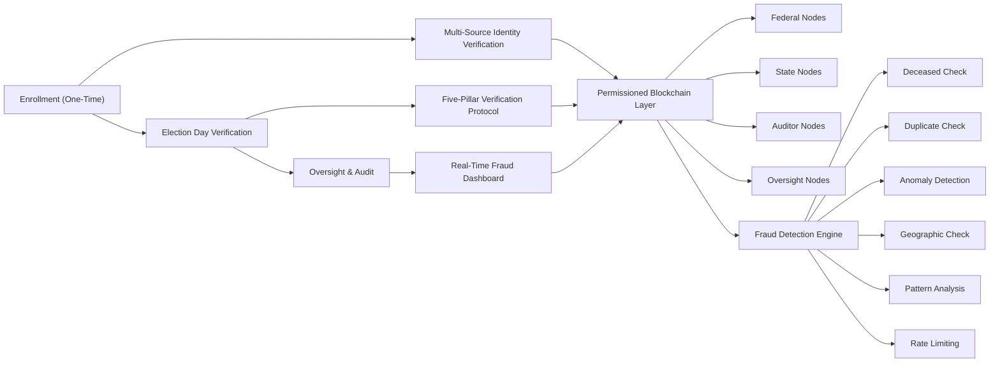
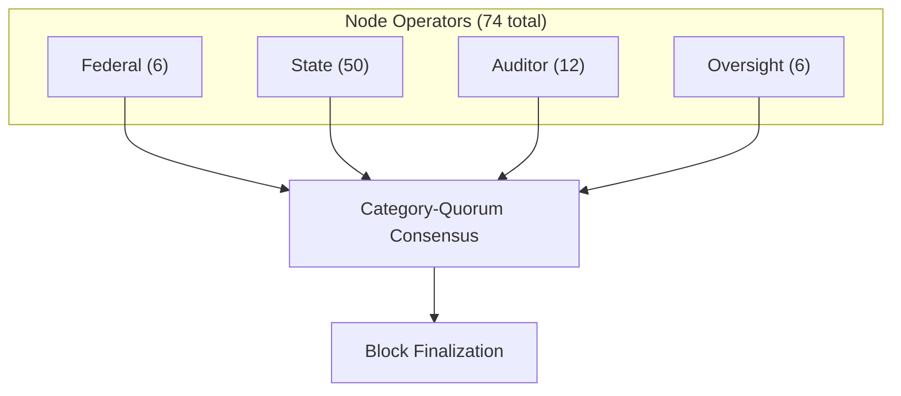
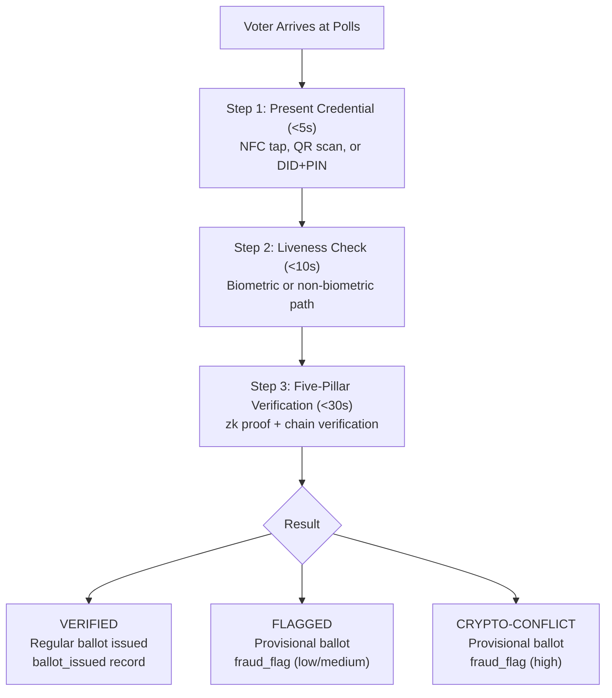
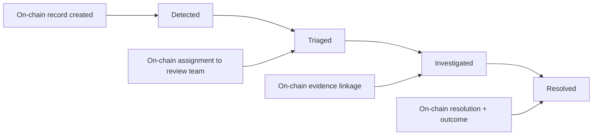
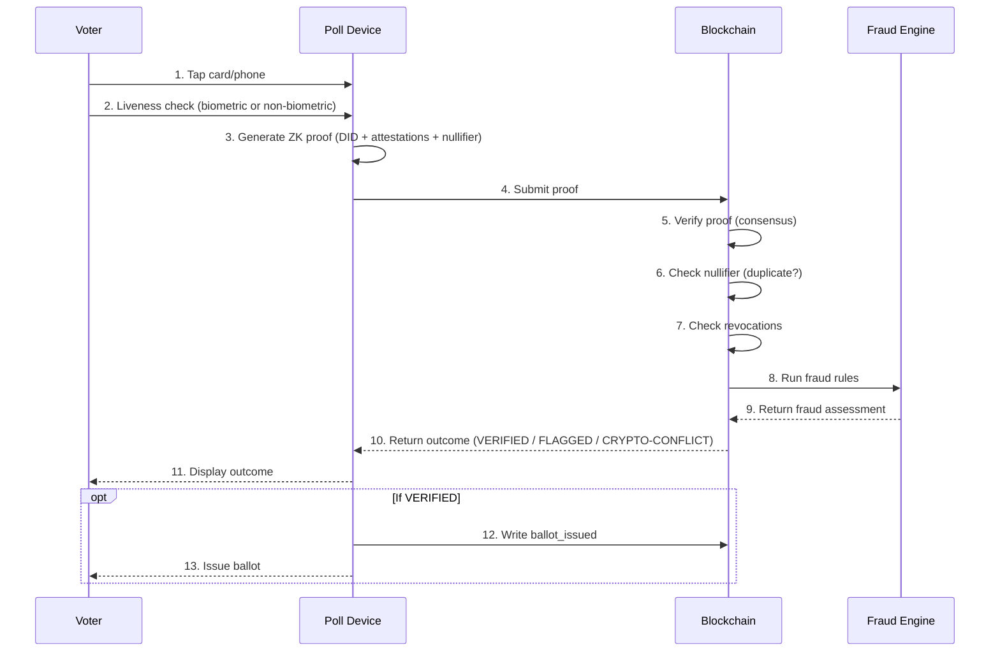

# PRD: VoteChain — Blockchain-Based Voter Verification & Hybrid Fraud Detection

> **A blueprint for replacing burdensome ID-check-every-time voting with a cryptographically
> secure, privacy-preserving, fraud-catching verification system for U.S. federal elections.**

**Version:** 1.0 Draft
**Date:** 2026-02-06
**Status:** Proposal / Blueprint
**Authors:** Absurdity Index Project

## Intro: Status and Policy Intent

This document is a technical and policy blueprint, not a validated production system.

- It has not been deployed nationally, certified for federal election operations, or
  proven through full-scale live elections.
- Performance, security, and equity metrics in this PRD are design targets and assumptions
  that require pilot evidence.
- The policy intent is to provide a lower-burden, privacy-preserving alternative to
  SAVE Act-style approaches that rely on repeated document checks at voting time.
- This PRD is a good-faith proposal for reducing voter burden while improving verifiability;
  it is not legal advice.

## TL;DR

- Verify identity once; use cryptographic credentials for future elections.
- Keep ballots off-chain; use blockchain only for verification/audit events.
- Preserve voter rights with provisional-first handling for disputed cases.
- Prioritize equity: non-biometric path, no-fee enrollment, mobile and community support.
- Treat rapid POC as months, and production hardening as the long, risk-heavy phase.

## Explain It Like I'm 5

Imagine voting is like borrowing a library book:

- First, you make your library card one time.
- After that, you just show your card to check out books quickly.
- A big notebook keeps track so nobody checks out the same book twice.
- The notebook does not say which stories you like, only that a book was checked out.
- If something looks weird, you still get a temporary pass while adults check it.

VoteChain tries to do that for voting: make proving who you are easier, catch cheating
faster, and still protect your right to vote.

---

## Table of Contents

1. [Executive Summary](#1-executive-summary)
2. [Problem Statement](#2-problem-statement)
3. [Goals & Non-Goals](#3-goals--non-goals)
4. [System Overview](#4-system-overview)
5. [The Five Verification Pillars](#5-the-five-verification-pillars)
6. [Architecture](#6-architecture)
7. [Enrollment Flow](#7-enrollment-flow)
8. [Election Day Flow](#8-election-day-flow)
9. [Hybrid Fraud Detection Engine](#9-hybrid-fraud-detection-engine)
10. [Oversight & Audit System](#10-oversight--audit-system)
11. [Privacy Model](#11-privacy-model)
12. [Accessibility & Equity](#12-accessibility--equity)
13. [Threat Model & Security](#13-threat-model--security)
14. [Rollout Strategy](#14-rollout-strategy)
15. [Cost Analysis](#15-cost-analysis)
16. [Legal & Constitutional Considerations](#16-legal--constitutional-considerations)
17. [Open Questions](#17-open-questions)
18. [Citizen FAQ & Myth-Vs-Fact Rebuttals](#18-citizen-faq--myth-vs-fact-rebuttals)
19. [Appendices](#19-appendices)

---

## 1. Executive Summary

The current voter verification system in the United States is a patchwork. Some states
require photo ID. Some don't. Fraud claims (real or imagined) erode public trust. And the
solutions proposed — stricter ID laws — disproportionately burden the elderly, low-income
voters, rural communities, and minority populations, while doing little to catch
sophisticated fraud.

**VoteChain** proposes a fundamentally different approach:

- **Verify once, vote freely.** Citizens complete a thorough, multi-source identity
  verification *one time*. This generates a cryptographic credential that proves citizenship
  and eligibility without requiring a physical ID at every election. Enrollment support is
  delivered through local nonprofits and trained volunteers who run phone help lines and
  "come-to-you" onboarding for voters who need hands-on assistance.
- **Catch fraud with real-time + async enforcement.** Every verification event is recorded
  on an immutable blockchain ledger. Cryptographic conflicts (like duplicate nullifiers)
  are flagged at poll time, while death/eligibility risk signals are processed asynchronously
  with strict SLAs before certification.
- **Preserve privacy absolutely.** Zero-knowledge proofs allow the system to confirm "this
  person is eligible and hasn't voted yet" without revealing *who* they are or *how* they
  voted.
- **Create an unbreakable audit trail.** Every verification, flag, and resolution is
  cryptographically sealed. No one — not a poll worker, not a state official, not a
  database admin — can alter the record after the fact.

This is not a voting machine. It is a **verification and fraud detection layer** that sits
alongside existing election infrastructure. The companion **Election Web Protocol (EWP)**
extends this with a ballot integrity layer — the cryptographic chain of custody from cast
to tally — ensuring every ballot is encrypted, recorded, included, and counted correctly.

---

## 2. Problem Statement

### 2.1 The Current Landscape

| Problem | Impact |
|---------|--------|
| **Inconsistent verification** | 50 states, 50 different ID requirements. No unified standard. |
| **Voter burden** | Commonly cited estimates suggest roughly 21M Americans may lack government-issued photo ID (e.g., Brennan Center estimate; source-date dependent). Obtaining ID can require time, money, and supporting documents many voters struggle to access. |
| **Fraud detection is reactive** | Most fraud is caught weeks/months after elections via audits and tip lines. By then, invalid ballots may already be counted. |
| **Dead voter rolls** | States are slow to purge deceased voters. The SSA Death Master File has known lag times of months to years. Cross-state deaths are worse. |
| **Duplicate voting** | No real-time cross-state check exists during voting. A person registered in two states can theoretically vote in both. Detection relies on post-election list matching. |
| **Trust deficit** | Regardless of actual fraud rates, *perceived* fraud undermines democratic legitimacy. Both sides claim the system is broken. Neither has proposed a technical solution that addresses root causes. |

### 2.2 Why Current Proposals Fail

- **Stricter ID laws** solve authentication but increase burden and reduce turnout.
- **Same-day registration** improves access but weakens verification.
- **Post-election audits** catch fraud too late to change outcomes.
- **Centralized databases** create single points of failure and manipulation.

### 2.3 The Core Insight

The real problem isn't *showing an ID*. It's answering four questions with cryptographic
certainty:

1. **Is this person a U.S. citizen?**
2. **Are they eligible to vote in this jurisdiction?**
3. **Are they alive and physically present?**
4. **Have they already voted in this election?**

If you can answer these four questions with mathematical proof — at poll time for
cryptographic checks and asynchronously for slower data feeds — at scale, without burdening
the voter, you don't need to check a plastic card.

---

## 3. Goals & Non-Goals

### 3.1 Goals

| # | Goal | Success Metric |
|---|------|----------------|
| G1 | Verify voter eligibility without requiring physical ID at the polls | 95%+ of enrolled voters can verify with credential alone |
| G2 | Detect and flag fraud with hybrid timing | Cryptographic conflict flags in < 30 seconds; asynchronous risk flags in < 24 hours |
| G3 | Create an immutable, auditable record of every verification event | 100% of events recorded on-chain; zero retroactive modifications |
| G4 | Reduce voter burden compared to current ID requirements | Enrollment takes < 30 min; election day verification < 60 seconds |
| G5 | Preserve ballot secrecy and voter privacy | Zero-knowledge proofs; no PII on-chain; formal privacy audit passes |
| G6 | Enable independent oversight and public auditability | Third-party auditors can verify chain integrity without accessing PII |
| G7 | Catch deceased voter fraud | Cross-reference death records within 48 hours nationally |
| G8 | Catch duplicate voting across jurisdictions | Real-time cross-state duplicate detection during voting windows |
| G9 | Prevent wrongful disenfranchisement from legal-data uncertainty | 100% of unresolved judicial-eligibility cases receive provisional ballot + adjudication SLA |

### 3.2 Non-Goals

- **Replace ballot casting or counting systems within this document.** VoteChain is the
  verification layer. The companion **Election Web Protocol (EWP)** in
  `PRD-VOTECHAIN-ELECTION-WEB-PROTOCOL.md` defines the ballot integrity layer — the
  cryptographic chain of custody from cast to tally that completes the system.
- **Create a national voter database.** The system stores cryptographic commitments, not
  voter records.
- **Mandate unsupervised internet voting in v1.** The EWP ballot integrity protocol works
  at physical polling places (Mode 1) and supervised kiosks (Mode 2) first. Unsupervised
  remote casting (Mode 3) is a gated future deployment that requires independent
  certification. See EWP Section 11.2 for hard gate criteria.
- **Eliminate poll workers.** Humans remain in the loop for every flagged event.
- **Track how individuals vote.** Ballot secrecy is constitutionally sacred and technically
  enforced.

---

## 4. System Overview



---

## 5. The Five Verification Pillars

Every voter verification event must satisfy **all five pillars**. Each pillar produces an
independent cryptographic attestation. All five attestations are combined into a single
zero-knowledge proof that says: "This person is verified" — without revealing anything
about the person.

### Pillar 1: Citizenship Verification

**Question:** Is this person a United States citizen?

**Enrollment-time check** (performed once):

- Cross-reference against **SSA** (Social Security Administration) records
- Cross-reference against **USCIS** (U.S. Citizenship and Immigration Services) for
  naturalized citizens
- Cross-reference against **state vital records** for birth certificates
- Cross-reference against **U.S. passport records** (State Department)

**How it works:**

- At enrollment, the system queries these databases through secure government APIs
- A positive match from any *two* of the four sources constitutes verification
- The result is stored as a **cryptographic attestation** on-chain: a signed statement that
  says "Citizenship verified on [date] via [source types]" — without storing SSN, name, or
  any PII
- The attestation is bound to the voter's **Decentralized Identifier (DID)** — a
  cryptographic key pair that the voter controls

**Blockchain record:**

```json
{
  "type": "citizenship_attestation",
  "did": "did:votechain:zQ3shN7...",
  "verified": true,
  "source_count": 2,
  "source_types_hash": "0xab3f...",
  "issued_by": "enrollment_authority_node_17",
  "issued_at": "2026-03-15T10:30:00Z",
  "expires_at": "2036-03-15T10:30:00Z",
  "zk_proof": "0x7e2c..."
}
```

> **Note:** The `source_types_hash` proves which *categories* of sources were used without
> revealing the specific records. This allows auditors to verify the enrollment was
> thorough without accessing PII.

### Pillar 2: Eligibility Confirmation

**Question:** Is this person eligible to vote in this specific election, in this specific
jurisdiction?

**Election-time check** (performed each election):

- **Age:** Must be 18+ on election day (derived from enrollment attestation)
- **Residency:** Registered in the jurisdiction where they're voting
- **Judicial eligibility:** No active court/legal disqualifier under governing law, including:
  - felony disenfranchisement status where applicable
  - rights-restoration status (automatic restoration, pardon, clemency, court order)
  - court adjudications that remove voting eligibility where state law permits
  - election-crime disqualifiers where statute requires
- **Registration status:** Actively registered, not purged or inactive

**How it works:**

- At verification time, the system checks the voter's DID against the **state voter
  registration ledger** (a state-operated sidechain or state-linked smart contract)
- Each state maintains its own eligibility rules as **smart contract logic**
- A judicial-eligibility ruleset is versioned by statute + effective date and evaluated
  against authoritative court/corrections/restoration feeds
- The check produces a yes/no attestation without exposing voter details to the poll worker
- If judicial data is stale, missing, or conflicting, the system defaults to a
  **provisional ballot + expedited adjudication** flow (never silent denial)

**Why this matters for fraud detection:**

- If someone tries to vote using a DID that's registered in a different state, this pillar
  catches it immediately
- If someone's registration was validly purged (moved, deceased, etc.), it triggers a flag
  and routes the voter to a provisional ballot flow pending review

### Pillar 3: Liveness & Presence Verification

**Question:** Is the person presenting this credential alive and physically present?

This pillar prevents the most viscerally offensive fraud: dead people "voting."

**How it works:**

*Option A — Biometric (primary):*

- At enrollment, voter registers a **biometric template** (fingerprint, palm vein, or iris)
- The template is stored **on the voter's personal device or secure card** — NOT in a
  central database
- At the polls, a quick biometric scan matches against the locally-stored template
- The biometric never leaves the device/card; only a "match: yes/no" result is produced

*Option B — Non-biometric path (first-class):*

- For voters who cannot or do not want to use biometrics (disability, injury, religious
  objection, privacy preference):
  - **Knowledge factor:** PIN or passphrase set at enrollment
  - **Possession factor:** Enrolled device or issued secure card
  - **Poll worker attestation:** A poll worker confirms physical presence (signed attestation)
- This path is policy-equivalent to biometrics (same wait-time targets, same ballot access,
  same legal standing).

**Deceased voter detection (continuous):**

- The system subscribes to **continuous death record feeds** (cadence varies by source):
  - SSA Death Master File (as released)
  - State vital records offices
  - Hospital and coroner reporting systems
- When a death record matches a DID, the system:
  1. Writes a revocation decision on-chain within SLA (target: < 48 hours from feed arrival)
  2. Marks the DID as `status: deceased`
  3. If any future verification attempt uses that DID, it's **flagged instantly** and routed
     to provisional ballot handling
  4. The flag is immutable — it can't be cleared without oversight review

**Blockchain record for a deceased flag:**

```json
{
  "type": "fraud_flag",
  "flag_type": "deceased_voter_attempt",
  "did": "did:votechain:zQ3shN7...",
  "death_record_match": {
    "source": "ssa_dmf",
    "match_confidence": 0.997,
    "death_date": "1974-08-12",
    "matched_at": "2026-11-03T14:22:07Z"
  },
  "verification_attempt": {
    "polling_place": "precinct_hash_0x4f2a...",
    "timestamp": "2026-11-03T14:22:05Z"
  },
  "status": "pending_review",
  "assigned_to": "oversight_team_district_7"
}
```

> Someone dead for 50 years tries to "vote"? Once revocation exists on-chain, the system
> flags the attempt in seconds, preserves immutable evidence, and routes oversight review
> immediately while preserving provisional ballot rights.

### Pillar 4: Duplicate Vote Prevention

**Question:** Has this person already cast a ballot in this election?

This is where the blockchain architecture pays for itself.

**How it works:**

- When a voter completes verification and receives a ballot, a **vote commitment** is
  written to the blockchain:

  ```json
  {
    "type": "ballot_issued",
    "did": "did:votechain:zQ3shN7...",
    "election_id": "2026-general-federal",
    "jurisdiction": "state_hash_0x9c1d...",
    "issued_at": "2026-11-03T08:15:33Z",
    "nullifier": "0xf4a8..."
  }
  ```

- The `nullifier` is a one-time cryptographic token derived from the voter's DID + the
  election ID. Under correct implementation and uncompromised keys, generating a second
  valid nullifier for the same DID + election combination is cryptographically infeasible.
- **Before issuing any ballot**, the system checks: "Does a ballot_issued record with this
  nullifier already exist on-chain?"
- If yes → **immediate high-severity flag and provisional-only ballot path**
- This check is **cross-jurisdictional by design**. The blockchain is shared across all
  states. If someone votes in Pennsylvania at 8 AM and tries to vote in New Jersey at 2 PM,
  the second attempt is caught instantly.

**Why blockchain matters here:**

- A centralized database could be tampered with (delete the first record, allow a second
  vote). On a blockchain with multi-party consensus, altering a record requires corrupting
  a majority of nodes across federal, state, and independent auditor operators. This is
  computationally infeasible.
- The check is real-time because all nodes maintain a synchronized copy of the ledger.
  Consensus latency target: < 3 seconds.

### Pillar 5: Chain-of-Custody Integrity

**Question:** Has the verification process itself been tampered with?

This pillar verifies the *verifiers*.

**How it works:**

- Every verification device (poll pad, biometric scanner, etc.) has its own **device DID**
  and signing key, stored in a hardware security module (HSM)
- Every verification event is **co-signed** by both the voter's credential and the device
- The device's operational integrity is attested by its HSM at boot time and periodically
  during operation
- If a device is compromised, its attestations are revoked, and all verifications it
  performed are flagged for review

**Fraud this catches:**

- A compromised poll worker device rubber-stamping fake verifications
- A device that's been physically tampered with or replaced
- Software modifications to the verification client

---

## 6. Architecture

### 6.1 Blockchain Layer: Permissioned Consortium Chain

**Why not a public blockchain (Bitcoin, Ethereum)?**

- Public chains are too slow (Bitcoin: ~7 TPS, Ethereum: ~30 TPS). Election day needs
  thousands of TPS.
- Public chains are permissionless — anyone can run a node and read all data. Voter
  verification data, even pseudonymized, should not be globally readable.
- Gas fees and economic incentives are irrelevant to a government system.

**Recommended: Hyperledger Fabric or similar permissioned framework**

| Property | Specification |
|----------|---------------|
| **Consensus** | BFT ordering + category-quorum policy (no single operator category can unilaterally finalize) |
| **Throughput** | Target: 10,000+ TPS (sufficient for peak election day load) |
| **Finality** | < 3 seconds (global confirmation required for regular ballot issuance; degraded paths route to provisional) |
| **Node operators** | Federal (EAC/CISA), 50 state nodes, 10+ independent auditor nodes, congressional oversight nodes |
| **Data model** | Channels per state (for state-specific eligibility rules) + one national channel (for cross-state duplicate detection) |
| **Smart contracts** | "Chaincode" for verification logic, fraud detection rules, and flag routing |

### 6.2 Node Architecture



Consensus policy requirements:

1. `3 of 4` categories must approve a block.
2. Each approving category must have at least `2/3` of its nodes approving.
3. At least one independent category (`Auditor` or `Oversight`) must be in the approving set.

**Key design principle:** No single branch of government, no single state, and no single
political party can control a majority of nodes. Consensus requires cooperation across
categories.

### 6.3 Identity Layer: Decentralized Identifiers (DIDs)

Voters are identified by **W3C Decentralized Identifiers**, not by name, SSN, or address.

```text
did:votechain:zQ3shN7KpBxnGfEtAJc5MvZxPLsRuQW9KBZHS...
```

**Properties:**

- The voter holds the private key (on their device or secure card)
- The DID is created at enrollment and is **not linked to any PII on-chain**
- The link between a DID and a real person exists **only** in encrypted form at the state
  enrollment authority, accessible only by court order
- DIDs follow the W3C DID standard for interoperability

### 6.4 Zero-Knowledge Proof Layer

The system uses **zk-SNARKs** (Zero-Knowledge Succinct Non-Interactive Arguments of
Knowledge) to enable verification without disclosure.

**What the proof says:**
"I possess a valid credential that satisfies all five verification pillars for election
[election_id] in jurisdiction [jurisdiction_id]."

**What the proof does NOT reveal:**

- Who the voter is
- Their address, age, SSN, or any PII
- Which specific data sources verified their citizenship
- How they voted (the proof system is completely separate from ballot casting)

**Circuit design (simplified):**

```text
INPUTS (private — known only to voter):
  - DID private key
  - Citizenship attestation
  - Eligibility attestation
  - Liveness attestation result (biometric or non-biometric path)
  - Enrollment timestamp

INPUTS (public — known to verifier):
  - Election ID
  - Jurisdiction ID
  - Current timestamp
  - Nullifier (derived from DID + election ID)

CIRCUIT LOGIC:
  1. Verify DID private key matches a registered DID
  2. Verify citizenship attestation is valid and not expired
  3. Verify eligibility attestation matches jurisdiction
  4. Verify liveness/biometric attestation is fresh (< 5 min)
  5. Compute nullifier and confirm it hasn't been used
  6. Output: VERIFIED / NOT VERIFIED
```

### 6.5 Off-Chain Components

Not everything belongs on the blockchain.

| Component | Location | Why off-chain |
|-----------|----------|---------------|
| PII vault | State-operated, air-gapped encrypted storage | PII must never touch the blockchain |
| Biometric templates | Voter's personal device or secure card | Biometrics must stay local to the voter |
| Death record feeds | Secure API gateway → blockchain oracle | Raw records are processed before attestations are written on-chain |
| Fraud review case files | Oversight team secure portal | Investigation details may contain sensitive info |
| Voter enrollment UI | Web/mobile app + in-person kiosks | User-facing systems are off-chain by nature |

---

## 7. Enrollment Flow

Enrollment is the **heaviest** step. It happens once (or once per decade for re-verification).
The goal is to make it thorough enough that election-day verification can be lightweight.

### 7.1 Enrollment Channels

| Channel | Description | Target Population |
|---------|-------------|-------------------|
| **In-person at DMV/SSA office** | Leverage existing government office visits | General population |
| **In-person at dedicated enrollment centers** | Set up in libraries, community centers, post offices | Urban and suburban |
| **Mobile enrollment units** | Buses/vans that travel to underserved areas | Rural, elderly, disabled |
| **Assisted enrollment** | Trained volunteers help voters through the process | Low-tech-comfort voters |
| **Community partner support** | Local nonprofits and trained volunteers staff phone lines and "come-to-you" onboarding support | Homebound, elderly, low-tech-comfort, and hard-to-reach voters |
| **Online pre-enrollment** | Start the process online, complete in-person | Tech-savvy voters |

> **No channel requires the voter to already have a government-issued photo ID.** The system
> verifies identity through multi-source database matching, not by looking at a card.

### 7.2 Enrollment Steps

1. `STEP 1: IDENTITY CLAIM`
   Voter provides name, date of birth, SSN (or last 4 + other identifiers), address, and contact data.
   This is used only for matching and is not stored on-chain.
2. `STEP 2: MULTI-SOURCE VERIFICATION` (automated, target < 5 minutes)
   Query SSA, state vital records, USCIS (if naturalized), and State Dept (if passport holder).
   Requirement: `2 of 4` sources confirm; otherwise escalate to manual review.
3. `STEP 3: LIVENESS METHOD ENROLLMENT`
   Voter chooses local biometric or non-biometric multi-factor path.
   If biometric is used, template remains on voter-controlled device/card and is not written on-chain.
4. `STEP 4: DID GENERATION`
   Generate key pair on voter device/card, register public DID on-chain, keep private key local.
   Configure recovery via Shamir sharing across designated recovery agents.
5. `STEP 5: CREDENTIAL ISSUANCE`
   Issue W3C Verifiable Credential containing DID plus core attestations, signed by enrollment authority.
6. `STEP 6: REGISTRATION BINDING`
   Link DID to state voter registration in encrypted state storage; on-chain data records only hashed jurisdiction linkage.

### 7.3 Enrollment Edge Cases

| Scenario | Resolution |
|----------|------------|
| Voter has no SSN (rare but legal for some elderly citizens) | Use 3-of-3 alternative sources: birth cert + utility bills + sworn affidavit |
| Voter is homeless (no address) | Use shelter address or county election office address; residency is not required for federal elections |
| Voter lost device/card | Shamir recovery at state enrollment office with identity re-verification |
| Voter is incarcerated but eligible (varies by state) | Mobile enrollment units visit facilities; state eligibility rules enforced by smart contract |
| Voter is overseas/military | UOCAVA-compliant remote enrollment via consulate or base; chosen liveness method set up in-person at facility |

### 7.4 Overseas & Military (UOCAVA) Operations

VoteChain v1 remains a verification layer. For UOCAVA voters, this layer integrates with
existing absentee ballot request/return processes rather than replacing them.

#### 7.4.1 Scope and Legal Baseline

- Applies to U.S. citizens covered by UOCAVA (active-duty uniformed services, eligible
  family members, and U.S. citizens residing overseas).
- Federal-election participation is mandatory for states/territories; each jurisdiction must
  expose a UOCAVA-compatible VoteChain verification path.
- Verification status must never suppress a lawful UOCAVA ballot request; uncertain status
  routes to provisional adjudication and priority review.

#### 7.4.2 Enrollment and Re-Verification Channels Abroad

| Channel | Operating Entity | Typical User |
|---------|------------------|--------------|
| U.S. embassy/consulate enrollment desk | State Dept + election liaisons | Civilian overseas voters |
| Military installation enrollment desk | DoD + state election liaison | Active-duty/military families |
| Mobile enrollment kits (deployed units/ships) | Designated federal election support teams | Forward-deployed/shipboard personnel |
| Scheduled remote pre-check + in-person credential proofing | State election office + federal partner site | Voters who can pre-stage data but need local proofing |
| 24/7 global support desk | Federal + nonprofit partner consortium | Time-zone constrained voters needing live assistance |

#### 7.4.3 Credential Issuance, Recovery, and Continuity Abroad

- Credential issuance is allowed at designated overseas facilities with audited device DIDs.
- Recovery supports:
  - consular recovery appointments,
  - military legal/admin office assisted recovery,
  - emergency fallback to provisional absentee workflow when device/card is lost near
    deadline.
- If the voter cannot complete full recovery in time, the system must preserve ballot
  access via provisional path and post-election adjudication.

#### 7.4.4 UOCAVA Timing and Deadline Safeguards

- Provide a pre-election "credential readiness check" at least 45 days before election day.
- Time-zone aware deadline enforcement must use jurisdiction-local statutory cutoffs while
  showing voters their local time conversion.
- SLA targets for UOCAVA support:
  - credential-lockout triage: < 30 minutes
  - judicial eligibility conflict triage: < 2 hours
  - final adjudication before canvass deadline whenever legally possible
- Every unresolved case at ballot-return cutoff remains eligible for provisional handling
  with immutable case tracking.

#### 7.4.5 Deployed / Low-Connectivity Contingencies

- Support delayed-sync verification for authorized military environments with signed
  offline bundles and strict replay protection.
- If network constraints prevent real-time confirmation, generate a signed provisional
  verification envelope for later reconciliation.
- Define shipboard and austere-environment runbooks: device custody, key rotation,
  satellite outage handling, and secure log escrow.

#### 7.4.6 UOCAVA Quality Metrics

The oversight dashboard must separately report:

- UOCAVA enrollment completion rate
- Credential recovery success rate within deadline window
- UOCAVA provisional rate and resolution time
- Time-to-first-response for global support desk tickets
- Region/time-zone SLA attainment
- Appeals outcomes for UOCAVA voters

---

## 8. Election Day Flow

This is what voters experience. The design goal: **< 60 seconds, no paper, no hassle.**

### 8.1 Voter Experience



### 8.2 Verification Outcomes

| Outcome | Meaning | Voter Experience | On-Chain Record |
|---------|---------|------------------|-----------------|
| **VERIFIED** | All 5 pillars pass | Ballot issued, voter votes normally | `ballot_issued` with nullifier |
| **FLAGGED** | 1+ non-cryptographic risk signal (e.g., recently moved, death-record lag, judicial-record mismatch, name change pending) | Provisional ballot issued; voter is informed ballot is pending review | `ballot_issued_provisional` + `fraud_flag` with `severity: low/medium` |
| **CRYPTO-CONFLICT** | Cryptographic hard conflict (e.g., nullifier already used, invalid credential signature) | Provisional ballot issued; voter informed of high-priority review and next steps | `ballot_issued_provisional` + `fraud_flag` with `severity: high` |

> **Critical principle:** No verification outcome removes the right to cast a
> **provisional ballot** under existing federal law (HAVA, 2002). VoteChain adds a
> detection/evidence layer; it does not remove voter rights.

---

## 9. Hybrid Fraud Detection Engine

This is the heart of the system. The blockchain provides the immutable evidence; the
detection engine is the intelligence that watches for anomalies across two windows:

- **Poll-time (seconds):** cryptographic checks (nullifier conflicts, invalid signatures,
  compromised device attestations)
- **Async (minutes to hours):** data-feed and statistical checks (death records, judicial
  status updates, anomaly clustering)

### 9.1 Detection Categories

#### Category A: Deceased Voter Detection

**Data sources:**

- SSA Death Master File (ingested continuously on source release cadence)
- State vital records (death certificates)
- Hospital/coroner reports (where available)
- Obituary cross-reference (supplementary, lower confidence)

**Process:**

```text
CONTINUOUS (not just election day):
  1. Death record arrives via feed
  2. System matches against enrollment records using encrypted PII lookup
     (performed in secure enclave — PII never exposed to blockchain)
  3. On match: write REVOCATION record to blockchain
     {
       "type": "credential_revocation",
       "did": "did:votechain:zQ3sh...",
       "reason": "deceased",
       "evidence_hash": "0x9f3a...",
       "revoked_at": "2026-09-15T03:22:00Z"
     }
  4. If a verification attempt is made with a revoked DID:
     - High-severity flag + provisional ballot handling
     - Fraud flag created with full chain of evidence:
       who died, when, death record source, who attempted to use the credential,
       where, when, device attestation of the terminal used
     - Routed to oversight team within 30 seconds
```

**Key metric:** Time from death record arrival to revocation decision < 48 hours (vs.
current: months to years for voter roll purging).

#### Category B: Duplicate Vote Detection

**Process:**

```text
REAL-TIME (during voting):
  1. Voter presents credential at polls
  2. System computes nullifier (hash of DID + election ID)
  3. System queries national channel: does this nullifier exist?
  4. If YES:
     - IMMEDIATE CRYPTO-CONFLICT FLAG
     - Fraud flag created:
       {
         "type": "fraud_flag",
         "flag_type": "duplicate_vote_attempt",
         "did": "did:votechain:zQ3sh...",
         "first_vote": {
           "jurisdiction": "state_hash_PA",
           "timestamp": "2026-11-03T08:15:33Z",
           "polling_place_hash": "0x4f2a..."
         },
         "second_attempt": {
           "jurisdiction": "state_hash_NJ",
           "timestamp": "2026-11-03T14:22:05Z",
           "polling_place_hash": "0x8b1c..."
         },
         "status": "pending_review",
         "evidence_strength": "cryptographic"
       }
     - The first vote is VALID; the second attempt is provisional-only pending review
     - Both records are preserved as evidence for prosecution
  5. If NO:
     - Proceed with verification
     - Write nullifier to chain upon ballot issuance
```

**Why this is better than current systems:** Today, duplicate vote detection relies on
post-election cross-referencing of voter rolls between states — a process that takes
weeks and produces many false positives due to name/DOB collisions. VoteChain's
nullifier-based duplicate check reduces identity-collision false positives because it is
cryptographic rather than name/DOB probabilistic, while still requiring operational review
for implementation or integration errors.

#### Category C: Geographic Impossibility Detection

```text
REAL-TIME:
  1. Voter verified at Polling Place A at time T1
  2. Same DID (or linked DID cluster) attempts verification at Polling Place B at time T2
  3. System calculates: is it physically possible to travel from A to B in (T2 - T1)?
  4. If NO:
     - Flag with "geographic_impossibility"
     - Route second attempt to provisional ballot handling
     - Evidence preserved: timestamps, locations, device attestations
```

#### Category D: Anomaly Pattern Detection

These are statistical anomalies that don't represent individual fraud but may indicate
organized fraud.

| Pattern | Detection Method | Flag Severity |
|---------|-----------------|---------------|
| **Burst registrations:** 50+ enrollments from same address | Address clustering analysis on enrollment events | Medium |
| **Device anomaly:** Single device verifying 100+ voters | Device DID rate limiting + anomaly detection | High |
| **Temporal anomaly:** Votes cast at 3 AM from closed polling place | Time + location cross-reference against polling hours | Critical |
| **Nullifier collision:** Cryptographically unexpected under design assumptions; likely indicates compromise or severe bug | Cryptographic integrity check | Critical — halt and audit |
| **Revocation flood:** Mass credential revocations in short period | Rate analysis on revocation events | High |
| **Verification success rate anomaly:** 100% pass rate at one location vs. 97% average | Statistical outlier detection | Medium |

#### Category E: Enrollment Fraud Detection

Fraud doesn't just happen on election day. People may try to fraudulently enroll.

| Pattern | Detection Method |
|---------|-----------------|
| **Synthetic identity:** SSN + name + DOB don't match any real person | Multi-source verification at enrollment (Pillar 1) |
| **Stolen identity:** Real person's info used by someone else | Biometric binding — the real person's biometric won't match the impersonator |
| **Duplicate enrollment:** Same person enrolls twice under different info | Encrypted deterministic identity matching in secure enclave + manual adjudication (no centralized biometric database) |
| **Mass enrollment fraud:** Organized creation of fake identities | Pattern detection on enrollment events (same IP, same device, same location burst) |

#### Category F: Judicial Eligibility Drift Detection

Judicial status is legally complex and time-sensitive. This category detects when legal
status changed but state election records lag behind.

| Pattern | Detection Method | Default Handling |
|---------|------------------|------------------|
| **Recent restoration event not reflected in voter status** | Rights-restoration feed cross-check (pardons, clemency, sentence completion) | Provisional ballot + expedited same-day adjudication |
| **Court/corrections conflict** | Signed-source conflict detection between court docket and corrections feed | Provisional ballot + mandatory human review |
| **Out-of-date judicial ruleset** | Ruleset hash/version check against current statute effective date | Auto-flag jurisdiction; do not hard-fail voters |
| **Ambiguous disqualifier scope** | Rule-evaluation confidence threshold + legal exception library | Provisional ballot + legal desk escalation |

### 9.2 Fraud Flag Lifecycle

Every fraud flag follows a strict, auditable lifecycle:



Resolution outcomes:

- Confirmed fraud -> referred to DOJ/state AG.
- False positive -> cleared with reason code.
- System error -> corrected with post-mortem record.

**Every state transition is an immutable on-chain record.** You cannot delete a flag. You
cannot silently close an investigation. Every action is signed by the person who took it
and timestamped.

---

## 10. Oversight & Audit System

### 10.1 Oversight Teams

| Team | Composition | Jurisdiction |
|------|-------------|--------------|
| **Federal Oversight Board** | Bipartisan appointees + technical experts (appointed by joint congressional committee) | National-level anomalies, cross-state fraud |
| **State Oversight Teams** | State-level bipartisan teams (appointed by state legislatures) | State-level flags, enrollment fraud |
| **Independent Auditors** | Academic + NGO node operators | Continuous chain integrity verification |
| **Inspector General** | Existing federal IG structure | System operator misconduct, internal threats |

### 10.2 Real-Time Dashboard

The oversight teams operate from a **real-time dashboard** that shows:

Dashboard sections include:

**National Metrics**

| Metric | Value |
|--------|-------|
| Verified | 47,291,038 |
| Provisional | 312,091 |
| Crypto-Conflict | 4,217 |
| Pending | 2,156,773 |

**Fraud Flags (By Type)**

| Type | Count |
|------|-------|
| Total | 1,247 |
| Deceased | 89 |
| Duplicate | 342 |
| Geographic | 12 |
| Pattern | 804 |

**Chain Health**

| Metric | Value |
|--------|-------|
| Nodes online | 74/74 |
| Consensus time | 1.2s avg |
| TPS | 4,721 |
| Block height | 8,429,017 |

**Fraud Flags (By Severity)**

| Severity | Count |
|----------|-------|
| Critical | 3 |
| High | 127 |
| Medium | 804 |
| Low | 313 |

**Recent Flags (Auto-Updating)**

| Time | Type | Severity | State | Status |
|------|------|----------|-------|--------|
| 14:22 | Deceased | High | PA | Under Review |
| 14:21 | Duplicate | High | NJ -> PA | Confirmed |
| 14:19 | Pattern | Medium | OH | Triaging |
| 14:18 | Device | Critical | FL | Escalated |
| 14:15 | Burst | Medium | GA | Under Review |

### 10.3 Public Auditability

After each election, the blockchain data is made available for **public audit** with the
following constraints:

| Data | Public? | Why |
|------|---------|-----|
| Aggregate verification counts by jurisdiction | Yes | Public interest in election integrity |
| Fraud flag counts and categories | Yes | Transparency about system effectiveness |
| Chain integrity proofs (Merkle roots) | Yes | Anyone can verify the chain wasn't tampered with |
| Individual verification records | No | Privacy — but auditors with authorization can verify specific records |
| PII | Never | Constitutional and legal requirement |
| Flag resolution outcomes (anonymized) | Yes | Public accountability for how flags were handled |

### 10.4 Voter Notice, Appeals, and Adjudication SLA

Every adverse verification event requires a voter-facing due-process path that is visible,
timed, and auditable.

#### Notice Requirements

- At point of service, the voter receives a plain-language reason code (not raw internal
  logic) and immediate ballot-rights guidance.
- The voter receives a case ID and tracked status channel (paper receipt, SMS/email where
  available, and hotline callback option).
- Notices must be available in required languages and accessibility formats.

#### Appeals Workflow

```text
FLAGGED / CRYPTO-CONFLICT EVENT
  -> Provisional ballot issued
  -> Case opened (immutable ID)
  -> Tier 1 review (local election team)
  -> Tier 2 review (state adjudication unit + legal desk)
  -> Tier 3 escalation (state court / statutory channel as required by law)
  -> Final determination logged with legal basis and signer identities
```

#### SLA Targets

| Case Type | Target |
|-----------|--------|
| Voter notification at polling place | Immediate (< 2 minutes) |
| Tier 1 triage start | < 15 minutes from event |
| High-severity cryptographic conflict review | < 60 minutes |
| Judicial-record mismatch review | < 4 hours |
| Voter status update cadence | Every 24 hours until resolution |
| Final disposition | Before canvass/certification deadline whenever legally possible |

#### Decision Guardrails

- No fully automated final denial for contested eligibility states.
- If statutory disqualification is not proven with signed evidence, ballot remains in
  provisional adjudication path.
- All reversals and clearances must include explicit reason codes and signed reviewer
  attestation.

### 10.5 Evidence Standards and Chain of Custody for Contested Cases

Each contested case must maintain a complete evidence bundle:

- event hash and timestamp
- device DID attestation
- credential proof verification result
- relevant eligibility feed snapshots (judicial/death/registration)
- reviewer actions and timestamps
- legal basis cited for final determination

Operational requirements:

- Every artifact hash is anchored on-chain; large evidence objects remain encrypted off-chain.
- Access to case evidence requires role-based authorization and dual-control for sensitive
  PII views.
- Evidence export for courts uses signed manifests so third parties can independently verify
  integrity.
- Retention and purge schedules follow statutory requirements, with legal holds recorded as
  immutable case-state events.

---

## 11. Privacy Model

### 11.1 Privacy Principles

1. **No PII on-chain.** Ever. Names, SSNs, addresses, biometrics — none of it touches the
   blockchain.
2. **Voter anonymity at the polls.** Poll workers see a green light or red light. They do
   not see the voter's name, address, or any identifying information.
3. **Ballot secrecy preserved.** The verification system has zero connection to the ballot
   casting system. VoteChain knows *that* a DID was verified; it does NOT know *how* that
   person voted.
4. **PII minimization.** The enrollment PII vault retains only what is legally required for
   re-verification and fraud investigation. It is encrypted at rest with keys held by
   multi-party custodians.
5. **Right to audit.** A voter can verify their own verification record on-chain using
   their DID private key, confirming it accurately reflects their actions.

### 11.2 Data Retention

| Data | Retention | Rationale |
|------|-----------|-----------|
| On-chain verification records | Permanent (immutable by design) | Audit trail integrity |
| Enrollment PII (encrypted vault) | 10 years after last verification, then purged | Legal holds, re-verification |
| Biometric templates (on voter device) | Until voter deletes or device is replaced | Voter-controlled |
| Fraud investigation files | Per existing record retention laws (varies) | Legal compliance |
| System logs (off-chain) | 7 years | Operational forensics |

### 11.3 Adversarial Privacy Analysis

| Attack | Mitigation |
|--------|------------|
| **Correlate DID with identity via voting location + time** | Verification records use polling-place hashes, not addresses. Timestamps are rounded to 15-min windows on-chain. |
| **Subpoena blockchain for political targeting** | DIDs are pseudonymous; linking a DID to a person requires court-ordered access to the state PII vault. |
| **Node operator reads verification data** | All verification data is encrypted in transit and at rest. Node operators see encrypted blobs, not cleartext. |
| **Government forces voter to prove how they voted** | The system literally cannot reveal this. Ballot secrecy is enforced by architectural separation, not policy. |

---

## 12. Accessibility & Equity

This section is non-negotiable. If the system doesn't work for everyone, it fails its
core mission.

### 12.1 Design Requirements

| Requirement | Implementation |
|-------------|----------------|
| **No smartphone required** | Secure cards issued free at enrollment for voters without phones |
| **No internet required for voter** | Polling place devices handle all connectivity; voter only needs card/phone tap |
| **Human onboarding help** | Local nonprofits and trained volunteers provide phone support and "come-to-you" enrollment/re-verification assistance |
| **Language support** | Enrollment UI in all Section 203-required languages; poll devices in top 15 U.S. languages |
| **Disability access** | Audio guidance, large text, tactile card for blind/low-vision voters; seated-height kiosks |
| **No cost to voter** | Enrollment is free. Secure cards are free. Device replacement is free. Period. |
| **Rural access** | Mobile enrollment units; enrollment by mail with in-person liveness-method setup at nearest post office |
| **Elderly access** | Assisted enrollment; simple card-based verification (no screens to navigate) |
| **Incarcerated but eligible** | In-facility enrollment and verification per state law |

### 12.2 Enrollment Equity Metrics

The system must track and report:

- Enrollment rates by demographic group (race, age, income, disability status)
- Enrollment center accessibility scores
- Wait times by location and time
- Failure/escalation rates by demographic group
- Provisional ballot rates by demographic group

**If any demographic group has an enrollment rate more than 5% below the national average,
the responsible jurisdiction must publish a remediation plan within 30 days.**

---

## 13. Threat Model & Security

### 13.1 Threat Categories

| Threat | Severity | Mitigation |
|--------|----------|------------|
| **Nation-state attack on blockchain nodes** | Critical | Geographically distributed nodes; HSM-protected keys; nodes on separate networks; DDoS protection; air-gapped backup nodes |
| **Compromised enrollment authority** | Critical | Multi-party enrollment signing (2-of-3 authorities must co-sign); enrollment anomaly detection; periodic re-verification campaigns |
| **Quantum computing breaks cryptography** | Long-term | Post-quantum cryptographic algorithms (NIST PQC standards) for all new key generation; migration plan for existing keys |
| **Insider threat (node operator)** | High | No single operator can alter records; consensus requires multi-category agreement; all operator actions logged on-chain |
| **Wrongful disenfranchisement from stale/incorrect judicial data** | Critical | Default-to-provisional on uncertainty; signed judicial data feeds; statute-versioned rulesets; independent legal QA and appeals SLA |
| **Social engineering of voter** | Medium | Voter education campaigns; VoteChain cannot reveal vote content even if voter is coerced to share DID |
| **Physical attack on polling device** | Medium | HSM-backed device integrity; tamper-evident hardware; device attestation revocation |
| **Denial of service on election day** | Critical | Offline-capable verification (devices cache recent chain state); fallback to provisional ballots; redundant network paths |

### 13.2 Failure Modes & Fallbacks

| Failure | Fallback |
|---------|----------|
| Blockchain network down | Polling devices cache last known chain state; verifications proceed in "optimistic mode" with post-election reconciliation |
| Voter's device/card lost on election day | Identity verified by poll worker + provisional ballot (existing HAVA process) |
| Biometric scanner failure | Immediate switch to non-biometric path (PIN/passphrase + device/card + attestation) |
| Judicial/corrections feed outage or delayed sync | Do not hard-fail voter; issue provisional ballot and route to expedited legal adjudication queue |
| Enrollment database breach | PII is encrypted with per-record keys; breach of database without keys yields encrypted blobs; keys stored separately in HSMs |
| Single state node compromised | State is reduced to observer status; other nodes continue consensus; state has 24 hours to bring backup node online |

### 13.3 Penetration Testing & Red Team Requirements

- **Annual red team exercise** by at least two independent firms
- **Continuous bug bounty program** with rewards up to $500K for critical vulnerabilities
- **Pre-election stress test** 60 days before each federal election simulating 2x expected load
- **Results published publicly** (with responsible disclosure timeline for vulnerabilities)

### 13.4 Ballot Integrity Protocol (EWP) And Unsupervised Remote Casting

The companion **Election Web Protocol (EWP)** in `PRD-VOTECHAIN-ELECTION-WEB-PROTOCOL.md`
defines the ballot integrity layer — the cryptographic chain of custody from cast to tally.
EWP applies to all deployment modes:

- **Mode 1 (in-person):** EWP ballot integrity at polling places — the primary deployment
  target. Replaces physical chain of custody with cryptographic proof.
- **Mode 2 (supervised):** EWP at UOCAVA facilities, consulates, supervised kiosks.
- **Mode 3 (unsupervised remote):** EWP from personal devices. This mode is **gated** —
  deployment requires clearing all hard gate criteria in EWP Section 11.2.

Key hurdles specific to Mode 3 that must be solved before production use:

- **Coercion resistance in uncontrolled environments** (home/work pressure, vote buying)
- **Receipt-freeness with verifiability** (voter can verify inclusion without gaining a
  coercion-enabling proof of ballot choice)
- **Endpoint integrity** (malware, browser tampering, phishing overlays, SIM-swap account recovery abuse)
- **Network privacy** (IP-to-voter correlation via OHTTP or equivalent proxy)
- **Phishing gateway defense** (voter must reliably authenticate the real gateway)
- **Equity and access parity** (no disenfranchisement for voters without compatible devices,
  broadband, or digital literacy)

No Mode 3 deployment should proceed until these controls are independently tested in
controlled pilots and certified by federal election and cybersecurity authorities. See
EWP Section 11.2 for the formal gate criteria table.

### 13.5 Election Day Incident Command and Runbooks

VoteChain operations use a formal incident command structure on federal-election days.

#### Command Structure

| Role | Primary Responsibility |
|------|------------------------|
| National Incident Commander | Cross-jurisdiction coordination, severity declaration, federal comms |
| Technical Operations Lead | Chain health, node performance, network remediation |
| Election Operations Lead | Polling-place support, provisional-flow continuity |
| Legal and Compliance Lead | Statutory interpretation, emergency legal escalations |
| Public Communications Lead | Voter-facing advisories, rumor control, media statements |
| Auditor Liaison | Independent observer access and evidentiary transparency |

#### Severity Levels

- **SEV-1 (Critical):** National impact or legal risk to certification timeline.
- **SEV-2 (High):** Multi-state service degradation with active voter impact.
- **SEV-3 (Medium):** Localized disruption with available workaround.
- **SEV-4 (Low):** Minor defect; no voter-rights impact.

#### Core Runbooks

| Scenario | Trigger | Immediate Actions | Voter-Protection Rule |
|----------|---------|-------------------|-----------------------|
| Chain consensus degradation | Finality latency exceeds threshold for 5+ minutes | Enter degraded mode, prioritize read-path checks, queue writes for reconciliation | Issue provisional ballots rather than pause voting |
| Judicial/death feed outage | Authoritative feed unavailable or stale beyond SLA | Freeze hard disqualifier automation from affected feed, open legal triage queue | Default to provisional for uncertain cases |
| Poll-device compromise | Device attestation revoked or tamper alert | Quarantine device DID, rotate to backup hardware, flag prior events for review | Continue operations with backup device + provisional fallback |
| Coordinated phishing/credential theft campaign | Elevated fraud reports + IOC confirmation | Push signed warning banner, revoke affected credentials, force stepped-up recovery | Preserve ballot access through assisted recovery + provisional path |
| DDoS / network saturation | Sustained inability to reach core services | Activate traffic scrubbing + regional failover + offline assist channels | No polling place turned away solely for network failure |
| Disinformation surge | Verified false claim spreading at scale | Publish canonical rebuttal bulletin, synchronize state messaging, log rumor events | Provide clear voter instructions to prevent abandonment |

#### Time-Bound Incident SLAs

| Milestone | Target |
|-----------|--------|
| Incident acknowledgment | < 5 minutes |
| Severity assignment | < 10 minutes |
| First voter-facing advisory for SEV-1/SEV-2 | < 15 minutes |
| Workaround activation for affected jurisdictions | < 30 minutes |
| Initial public after-action summary | < 24 hours after containment |

#### After-Action Requirements

- Every SEV-1/SEV-2 incident produces a public report with timeline, root cause, and
  remediation commitments.
- Corrective actions are tracked as auditable work items with owners and deadlines.
- Repeat incidents require escalation review by the oversight board and independent auditors.

---

## 14. Rollout Strategy

This roadmap separates rapid product validation from production readiness.

- `Rapid POC` should happen in months with working systems that people can use.
- `Production hardening` is the hard part and is expected to take substantially longer.

### Phase 0: Governance and Standards (Parallel Track, Months 1-12)

| Milestone | Timeline | Details |
|-----------|----------|---------|
| Congressional authorization | M1-M6 | Legislation establishing VoteChain, governance, and funding authority |
| Standards body creation | M3-M9 | Joint NIST/EAC/CISA working group defining technical and assurance standards |
| Government data/API modernization baseline | M1-M9 | Inventory and modernization plan for SSA/USCIS/state-vital/corrections/restoration interfaces with SLA targets |
| Election Web Protocol (EWP) ballot integrity layer | M3-M9 | Define ballot integrity protocol (cast-to-tally chain of custody) for in-person (Mode 1), supervised (Mode 2), and gated remote (Mode 3) deployment |
| Privacy impact assessment | M6-M9 | Full PIA with public comment period |
| Procurement framework and operator selection | M9-M12 | Competitive RFP and initial node/operator selection |

### Phase 1: Rapid POC (Months 1-6)

| Milestone | Timeline | Details |
|-----------|----------|---------|
| Core blockchain deployment (testnet) | M1-M3 | 74-node equivalent test environment operational |
| Identity layer development | M1-M4 | DID issuance, credential management, and initial ZKP circuits |
| API integration POC | M1-M5 | Signed adapter layer with mock data + limited live read-only connectors |
| Enrollment system POC | M2-M5 | Multi-channel enrollment UX with test datasets |
| Fraud detection engine POC | M3-M5 | All defined detection categories running on synthetic/replay data |
| Oversight dashboard POC | M3-M5 | Real-time monitoring and flag triage prototype |
| Interactive demo labs | M4-M6 | Hands-on systems for voters, poll workers, and auditors |
| Closed mock election | M6 | End-to-end rehearsal with real participants |
| POC exit report | M6 | Publish measured limits, risks, and go/no-go criteria for hardening |

### Phase 1.5: Production Hardening (Months 6-24)

| Milestone | Timeline | Details |
|-----------|----------|---------|
| Full API modernization implementation | M6-M24 | High-availability adapters and signed data pipelines for enrollment/judicial/death/restoration feeds |
| Security hardening + red-team cycles | M9-M24 | Repeated adversarial testing, remediation, and retest gates |
| Human mock-election program (expanded) | M9-M24 | Large-scale multi-cohort usability and resilience drills |
| Observability and incident operations | M9-M24 | SRE controls, alerting, incident command rehearsals, and recovery drills |
| Data quality and legal adjudication readiness | M9-M24 | Jurisdiction rules QA, due-process workflow validation, appeals staffing |
| Reliability and failover validation | M12-M24 | Latency/load/failover testing with publishable scorecards |
| Independent readiness assessment | M21-M24 | External audit package and pilot-entry recommendation |

### Phase 2: Live Pilot (Months 24-36)

| Milestone | Timeline | Details |
|-----------|----------|---------|
| Pilot jurisdiction selection | M24-M25 | 3-5 jurisdictions representing demographic and operational diversity |
| Pilot enrollment | M25-M30 | Enroll pilot voters; target 50%+ enrollment in pilot areas |
| Pilot election (local) | M30-M33 | VoteChain verification runs alongside existing methods |
| UOCAVA operational pilot | M30-M33 | Overseas/military enrollment, recovery, and deadline-aware adjudication in live conditions |
| EWP Mode 1 + Mode 2 pilot | M30-M33 | In-person and supervised ballot integrity protocol in live conditions; Mode 3 pilot only if all EWP Section 11.2 gate criteria are cleared |
| Pilot analysis | M33-M36 | Measure fraud detection, voter experience, and adjudication outcomes |
| Pilot report (public) | M36 | Publish transparent results and required remediations |

### Phase 3: Federal Rollout (Months 36-60)

| Milestone | Timeline | Details |
|-----------|----------|---------|
| State-by-state onboarding begins | M36-M52 | Phased implementation for federal-election verification with fallback continuity |
| National enrollment target: 80% | M44-M56 | Expansion supported by free enrollment, mobile units, and partner support |
| First federal election with VoteChain | M56-M60 | Federal-election verification mandatory nationwide (state/local extension optional) |
| Post-election analysis | M60+ | Public report, remediation backlog, and standards updates |

### Phase 4: Maturity (Months 60+)

- States may choose VoteChain verification for state/local elections (state legislative choice).
- Continuous improvement of fraud detection, adjudication quality, and accessibility.
- Ongoing standards engagement and interoperability work.

---

## 15. Cost Analysis

### 15.1 Baseline Cost Model (Planning Estimate)

| Category | One-Time Cost | Annual Cost | Notes |
|----------|--------------|-------------|-------|
| **Blockchain infrastructure** (74 nodes, HSMs, networking) | $120M | $25M | Distributed across federal + state budgets |
| **Software development** (identity layer, ZKP, fraud engine, dashboard) | $200M | $40M | Including ongoing development and maintenance |
| **Enrollment infrastructure** (kiosks, mobile units, devices) | $300M | $60M | ~$2/enrolled voter for 150M voters |
| **Secure cards** (for voters without phones) | $150M | $30M | ~$3/card including NFC chip + secure element |
| **Staffing** (enrollment workers, oversight teams, operations) | — | $150M | Largest ongoing cost |
| **Security** (red team, bug bounty, audits) | — | $20M | Non-negotiable |
| **Voter education & outreach** | $100M | $50M | Critical for adoption and equity |
| **TOTAL (baseline model)** | **~$870M** | **~$375M/yr** | |

### 15.2 Cost Sensitivity Scenarios

The baseline model assumes substantial reuse of existing government infrastructure and
minimal API modernization overruns. Given known federal IT delivery risk, the program
should be budgeted with scenario bands:

| Scenario | One-Time | Annual | Key Assumptions |
|----------|----------|--------|-----------------|
| **Baseline** | ~$0.9B | ~$0.4B | Major systems integrate with limited retrofit; low rework |
| **Expected** | ~$2.0B-$2.8B | ~$0.5B-$0.7B | Significant API/data modernization and phased hardware expansion |
| **High-risk** | ~$3.0B-$4.0B | ~$0.7B-$0.9B | Multi-year legacy-system remediation, procurement delays, and expanded support burden |

Primary risk drivers:

- Legacy system integration and data quality remediation
- State-by-state implementation variance and statutory mapping complexity
- Hardware lifecycle replacement and secure logistics
- 24/7 support staffing, training, and election-week surge capacity
- Security hardening, audits, and incident-response program growth

### 15.3 Cost Context

- One commonly cited estimate places 2020 U.S. election administration spending at roughly
  **$4.1 billion** across jurisdictions (source-date dependent; refresh each cycle)
- VoteChain annual cost represents roughly **9% (baseline)** and approximately
  **12%-22% (expected/high-risk)** of existing election administration spending
- Cost per enrolled voter: approximately **$8.30/year** (assuming 150M enrolled voters)
- Cost per verified vote: approximately **$5.60** (assuming 67% turnout)
- For context, a single contested election recount costs $3M-$10M+ per state; a single
  legal challenge can cost tens of millions. A system that reduces contested outcomes by
  even 10% pays for itself.

---

## 16. Legal & Constitutional Considerations

### 16.1 Constitutional Framework

| Provision | Relevance | VoteChain Compliance |
|-----------|-----------|---------------------|
| **14th Amendment (Equal Protection)** | Voter verification must not discriminate | Free enrollment, multiple channels, accessibility mandates, demographic monitoring |
| **15th Amendment (Race)** | Cannot deny vote based on race | Equity metrics with mandatory remediation; DOJ oversight |
| **19th Amendment (Sex)** | Cannot deny vote based on sex | System is sex/gender-blind by design |
| **24th Amendment (Poll Tax)** | Cannot condition voting on payment | All VoteChain services are free to voters |
| **26th Amendment (Age 18+)** | Voting age is 18 | Enforced in eligibility smart contract |
| **Article I, Section 4** | States run elections; Congress can regulate federal elections | Federal-election verification participation is mandated by federal statute; state/local extension remains optional |
| **Voting Rights Act (1965)** | Protections against voter suppression | Language access, Section 203 compliance, preclearance-equivalent monitoring |
| **HAVA (2002)** | Provisional ballots must be available | Provisional ballot process preserved as fallback for any verification failure |

### 16.2 Required Legislation

1. **VoteChain Authorization Act** — Establishes the system, its governance structure, and
   appropriates initial funding
2. **Amendments to HAVA** — Recognize blockchain-based verification as a valid alternative
   to existing methods
3. **Privacy protections** — Explicitly prohibit using VoteChain data for non-election
   purposes (immigration enforcement, law enforcement, commercial use)
4. **Federal participation requirement + state/local opt-in** — Require all states and
   territories to support VoteChain verification for federal elections, while preserving
   optional adoption for state/local elections
5. **Judicial eligibility data and due-process framework** — Standardize signed data exchange
   from courts/corrections/restoration authorities, establish error-correction SLAs, and
   guarantee fast appeal pathways for challenged eligibility determinations

### 16.3 Legal Risks

| Risk | Mitigation |
|------|------------|
| Challenge under Burdick v. Takushi (undue burden on voting) | Free, accessible enrollment; existing methods remain as fallback; system reduces burden compared to current ID requirements |
| State sovereignty concerns | Federal mandate limited to federal elections; state/local adoption remains voluntary |
| Biometric privacy laws (BIPA, etc.) | Biometrics stored only on voter device, never centrally; architecture is intended to support BIPA-like requirements, subject to jurisdiction-specific legal review |
| 4th Amendment (search/seizure) | PII access requires court order; no dragnet searches; voter controls their own DID |

---

## 17. Open Questions

These are areas requiring further research, stakeholder input, or policy decisions before
implementation:

| # | Question | Impact | Proposed Next Step |
|---|----------|--------|-------------------|
| 1 | **Which specific blockchain framework?** Hyperledger Fabric, Hyperledger Besu, or custom? | Architecture | Competitive evaluation with 90-day proof-of-concept from top 3 candidates |
| 2 | **Which ZKP system?** Groth16, PLONK, STARKs? Each has different tradeoff profiles for proof size, generation time, and trusted setup requirements. | Performance & security | Benchmark with realistic election-day load simulations |
| 3 | **How to handle the 50 different judicial eligibility regimes** (felony disenfranchisement, restoration, adjudications, election-crime disqualifiers) in smart contract logic? | Eligibility pillar | Work with NCSL + state courts to codify all 50 state rules; publish as open-source, statute-versioned rules library with legal QA harness |
| 4 | **How should federal compliance be enforced if a state/territory misses implementation deadlines?** | Governance & rollout | Define statutory funding conditions, waiver policy for emergencies, and federal backstop operations for continuity |
| 5 | **How to handle same-day registration states?** Enrollment takes time; same-day registrants can't do it on the spot. | Enrollment flow | Rapid-enrollment track (< 10 min) with reduced verification + provisional ballot until full verification completes |
| 6 | **Can the ZKP proof generation run on a $50 phone?** Proof generation is computationally expensive. | Accessibility | Offload computation to polling place device (voter's key signs, device computes proof) |
| 7 | **What is the governance model for updating smart contracts?** Bug fixes and rule changes need a process. | Governance | Multi-party approval (federal + state majority + auditor sign-off) for any contract update; 30-day public comment for non-emergency changes |
| 8 | **How to handle naturalized citizens whose USCIS records are incomplete?** Legacy records from before digitization are inconsistent. | Enrollment edge case | Alternative verification path with sworn affidavit + 3 supporting documents + manual review |
| 9 | **Long-term governance of the oversight board.** How to keep it bipartisan and independent as political dynamics shift? | Institutional design | Staggered terms, supermajority removal requirements, inspector general with independent authority |
| 10 | **Interoperability with tribal nations.** Tribal IDs and governance structures are unique. | Equity | Dedicated engagement with tribal governments; tribal enrollment authorities as first-class system participants |
| 11 | **What are the gate criteria for unsupervised remote casting (EWP Mode 3)?** The companion EWP defines a ballot integrity protocol for all modes, with hard gate criteria for Mode 3 in Section 11.2. | Security & standards | Resolve all EWP Mode 3 gate criteria (coercion mitigation, network privacy, client integrity, phishing defense, equity parity) through independent testing and federal certification before any Mode 3 deployment |
| 12 | **How should UOCAVA absentee-return deadlines be harmonized with adjudication SLAs across states?** | UOCAVA operations | Build a state-by-state deadline matrix, publish machine-readable cutoff rules, and require deadline-aware triage queues |
| 13 | **What minimum staffing model is required for 24/7 global voter support?** | Operations | Define baseline staffing by time zone/language, partner surge contracts, and election-week staffing multipliers |
| 14 | **Can required federal/state data sources meet reliability and latency targets without major modernization?** | Integration risk | Run a formal API readiness audit (coverage, uptime, error rates, schema quality) and publish a staged modernization plan with funding gates |

---

## 18. Citizen FAQ & Myth-Vs-Fact Rebuttals

### 18.1 Citizen FAQ

**Q1: Do I need a smartphone to use VoteChain?**
No. Free secure cards are provided, and in-person assisted verification is always available.

**Q2: Is biometric enrollment mandatory?**
No. A non-biometric path (PIN/passphrase + device/card + attestation) is always available
with equal legal standing.

**Q3: Can the government see how I voted?**
No. VoteChain verifies eligibility and ballot issuance only. Ballot selection remains in a
separate system by design.

**Q4: What happens if I get flagged at the polls?**
You can still cast a provisional ballot. Your case enters a tracked adjudication workflow
with notice, status updates, and appeal pathways.

**Q5: What if the system is wrong about my eligibility?**
The system defaults to provisional handling when data is uncertain. Final determinations
require signed evidence and documented legal basis.

**Q6: I live overseas or serve in the military. Can I still vote?**
Yes. UOCAVA paths are supported through embassies/consulates, military installations, and
global help channels, integrated with absentee workflows.

**Q7: What if I lose my device or card before the election?**
Recovery is available through designated offices and support channels. If not resolved in
time, provisional ballot rights remain.

**Q8: Can one agency or party control the system?**
No. The consortium chain requires multi-party consensus across federal, state, auditor, and
oversight nodes.

**Q9: Does VoteChain create a national voter database?**
No. On-chain records hold cryptographic attestations, not raw voter PII.

**Q10: Is there a fee to enroll or verify?**
No. Enrollment, secure cards, and required replacement support are free to voters.

### 18.2 Myth-Vs-Fact Rebuttals

| Myth | Fact |
|------|------|
| "Blockchain means speculative crypto tokens and fees." | VoteChain uses a permissioned government consortium chain with no token economics. |
| "False positives will stop people from voting." | Voter-rights guardrail is provisional-first for uncertain or contested cases. |
| "Biometrics are mandatory and centrally stored." | Biometrics are optional and, if used, stay local to voter-controlled media. |
| "Officials can secretly alter records after the election." | Verification and case-state transitions are immutable and independently auditable. |
| "This lets government track my vote choice." | Vote verification is architecturally separated from ballot selection and counting. |
| "Overseas and military voters are an afterthought." | UOCAVA operations are explicitly supported with dedicated enrollment, recovery, and SLA paths. |
| "If the network goes down, voting stops." | Runbooks require continuity via degraded mode and provisional handling. |
| "States lose all control of their elections." | Federal mandate scope is federal elections; state/local extension remains optional by state law. |
| "A flag means I am permanently blacklisted." | Every flag has a lifecycle, adjudication, and appeal process with auditable resolution. |
| "Remote internet voting is being forced immediately." | The EWP ballot integrity protocol deploys first at polling places (Mode 1) and supervised facilities (Mode 2). Unsupervised remote casting (Mode 3) is gated behind hard criteria that must be independently certified before deployment. |

### 18.3 Public Communications Commitments

- Publish a plain-language voter guide at least 90 days before each federal election.
- Maintain a real-time status page for operational incidents and recovery guidance.
- Issue same-day myth-vs-fact advisories during major disinformation events.
- Provide hotline scripts and multilingual templates so local election offices and nonprofit
  partners communicate consistent guidance.

## 19. Appendices

### Appendix A: Glossary

| Term | Definition |
|------|-----------|
| **DID** | Decentralized Identifier — a W3C standard for self-sovereign digital identities |
| **HSM** | Hardware Security Module — tamper-resistant hardware for cryptographic key storage |
| **Nullifier** | A one-time cryptographic token that prevents double-spending (or double-voting) |
| **zk-SNARK** | Zero-Knowledge Succinct Non-Interactive Argument of Knowledge — a cryptographic proof system |
| **Permissioned blockchain** | A blockchain where only authorized entities can operate nodes (vs. public chains where anyone can) |
| **Verifiable Credential** | A W3C standard for cryptographically-signed digital credentials |
| **BFT** | Byzantine Fault Tolerance — consensus mechanism that tolerates malicious nodes |
| **PII** | Personally Identifiable Information |
| **HAVA** | Help America Vote Act (2002) |
| **UOCAVA** | Uniformed and Overseas Citizens Absentee Voting Act |
| **EAC** | Election Assistance Commission |
| **CISA** | Cybersecurity and Infrastructure Security Agency |
| **NIST** | National Institute of Standards and Technology |

### Appendix B: Comparison to Existing Systems

| Feature | Paper ID Check | VoteChain | Centralized National DB |
|---------|---------------|-----------|------------------------|
| Voter burden | High (get ID, bring to polls) | Low (enroll once, tap to verify) | Medium (enroll, carry card) |
| Fraud detection speed | Post-election (weeks) | Hybrid: real-time cryptographic + async analytics | Near-real-time (minutes) |
| Deceased voter detection | Manual roll purging | Automated, continuous | Automated, but single point of failure |
| Duplicate vote detection | Post-election cross-match | Real-time cryptographic | Real-time, but tamperable |
| Tamper resistance | Low (fake IDs exist) | Very high (cryptographic) | Medium (central DB can be hacked) |
| Single point of failure | No (distributed) | No (distributed) | Yes (central DB) |
| Privacy | Moderate (poll worker sees your ID) | Very high (ZK proofs) | Low (government sees everything) |
| Cost per voter | ~$1-3/vote | ~$5.60/vote | ~$4/vote |
| Public auditability | None | Full (open chain) | Limited (government-controlled) |
| Survives a compromised official | No (they can look the other way) | Yes (immutable on-chain records) | No (they can alter the DB) |

### Appendix C: Technology Readiness Assessment

| Component | Current TRL | Maturity Notes |
|-----------|-------------|----------------|
| Permissioned blockchain (Hyperledger Fabric) | TRL 9 | Production-proven in supply chain, finance, healthcare |
| W3C DIDs | TRL 7-8 | Standards finalized; multiple production implementations |
| zk-SNARKs | TRL 6-7 | Proven in cryptocurrency (Zcash); government-scale applications are newer |
| Biometric verification (local) | TRL 9 | Widely deployed in smartphones, border control, banking |
| Post-quantum cryptography | TRL 5-6 | NIST standards published 2024; implementations maturing |
| Real-time fraud detection at scale | TRL 7-8 | Proven in financial fraud detection; election application is novel |

### Appendix D: Data Flow Diagram — Election Day Verification



### Appendix E: Evidence Status Register

This register marks whether major statements in this PRD are:

- **Verified:** backed by a cited source or directly testable artifact
- **Target:** design objective not yet empirically achieved
- **Estimate:** planning assumption with uncertainty band
- **Assumption:** architectural claim pending validation

| Claim Area | Example Claim | Status | Verification Method |
|------------|---------------|--------|---------------------|
| Voter-ID prevalence | "~21M Americans lack government-issued photo ID" | Externally cited estimate | Re-check cited study vintage before each major release |
| Election admin spend baseline | "2020 election administration cost estimate" | Externally cited estimate | Maintain source citation and update for newest cycle when available |
| Consensus finality | "< 3 second finality target" | Target | Measure in public performance test reports |
| ZK proof latency at poll | "< 30 second verification path" | Target | Hardware-in-the-loop benchmarking with published methodology |
| Duplicate detection quality | "Cryptographic nullifier reduces identity-collision false positives" | Assumption | Red-team tests + simulated adversarial datasets |
| Death/judicial feed SLAs | "< 48h revocation decision from feed arrival" | Target | Feed telemetry with independent audit sampling |
| Cost totals | Baseline/expected/high-risk budget ranges | Estimate | Quarterly re-forecast using actual procurement and delivery data |
| Political adoption timeline | Federal mandate + implementation schedule | Assumption | Legislative milestones and signed state/territory implementation MOUs |

Claim discipline rule for future edits:

- Avoid absolute language ("always", "never", "impossible") unless proven by formal model.
- Tag uncited numeric claims as estimates or targets until verified.
- Record source date for all externally sourced figures.

---

## Final Note

This system does not claim to eliminate all fraud. No system can. What it does:

1. **Makes fraud detectable with hybrid timing** — real-time for cryptographic conflicts,
   async for data-feed/statistical anomalies, not weeks or months later.
2. **Makes fraud provable** — every flag has a cryptographic evidence chain that can
   withstand legal scrutiny.
3. **Makes fraud visible** — oversight teams and the public can see exactly how many
   anomalies were detected and how they were resolved.
4. **Reduces voter burden** — verify once, vote freely, no card to carry (if you have a
   phone) or a free card if you don't.
5. **Removes the single point of trust** — no one person, agency, or political party
   controls the verification system.

The question isn't only whether this is technically possible. Many components exist in
production in adjacent domains, but national-scale election integration remains an
unproven systems challenge. Political will, legal alignment, and operational delivery are
as critical as the cryptography.

---

*This PRD was produced by the Absurdity Index project as a good-faith technical blueprint.
It is not affiliated with any political party, candidate, or government agency.*
