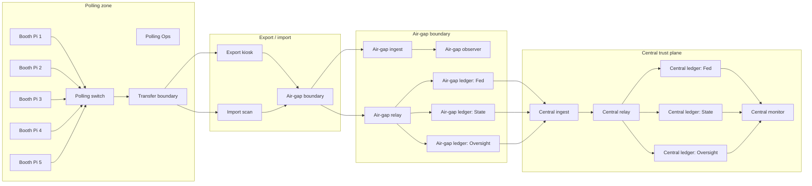

# Physical POC hardware plan (all-node physical demo)

This document captures a concrete, physical-only plan for a VoteChain demonstration where all protocol participants are separate devices on a demo board.

## Constraints for this plan

- All nodes are physical (no co-located containers/VMs).
- Goal is visibility for judges, operators, and auditors: every role is represented by a real box.
- Scope is Mode 1 / Mode 2 demo environments (in-person, institution-controlled nodes), not remote-only operation.
- Price estimates assume US sourcing and February 2026 market conditions; these vary significantly by supplier and lead time.

## Design principle

Split roles by trust boundary:

- Polling plane (voter-facing runtime and export path)
- Air-gap plane (ingest + relay + ledger quorum)
- Central plane (anchor write side + verification/monitoring)

Use separate physical boxes so demo presenters can point to each boundary and show explicit handoffs.

## Option A: Compact physical board (15-node, visible + stable)

This is the best option when you need many physical devices but still want controlled cost and setup time.

### Node roles

| Zone | Node | Quantity | Role |
|---|---|---:|---|
| Polling | `booth-pi-1..4` | 4 | Voter/session devices |
| Polling | `polling-ops` | 1 | Operator orchestration and local run logs |
| Transfer | `export-kiosk` | 1 | Egress signing + bundle handoff |
| Transfer | `import-scan` | 1 | Validation gateway before air-gap |
| Air-gap | `airgap-ingest` | 1 | Verifies and stores incoming bundle artifacts |
| Air-gap | `airgap-relay` | 1 | Relays to air-gap ledger and returns status |
| Air-gap | `airgap-ledger-node` | 1 | Ledger quorum simplification for compact demo (use 3-node quorum on full board below) |
| Central | `central-ingest` | 1 | Verifies, validates, and posts anchors |
| Central | `central-relay` | 1 | Pushes validated events to central trust plane |
| Central | `central-ledger-node` | 1 | Ledger quorum simplification (single service for compact board) |
| Central | `central-observer` | 1 | Monitoring/read-only status and evidence capture |

**Total: 15 nodes**

## Right tech for the right job (per node)

Do not use one hardware class for all roles. Separate by protocol function and failure risk:

- **Core consensus/ledger nodes (`*ledger*`):** must run full verification and replication workloads continuously and retain persistence. Require Linux SBC or x86 capable of sustained disk + network I/O.
- **Relay / ingest / scanner nodes (`*ingest`, `*relay`, `*scan`):** moderate baseline but should not be constrained on storage or single-threaded throughput.
- **Polling/session nodes (`booth-*`, `polling-ops`):** can be lighter, but still need stable Ethernet networking and enough RAM to run vote-runner processes.

### Minimum profile per role (recommended and acceptable)

| Role | Minimum (for stable demo) | Preferred | Why |
|---|---|---|---|
| Booth nodes (`booth-pi-*`) | Pi 3B+ / Pi 4B, 2GB RAM, SSD or fast micro-SD, wired Ethernet, 802.1Q-capable switch path | Pi 4B 4GB+, Pi 5 4GB+ | These are UI/operator-driven, low consensus stress, highest visibility requirement. |
| Polling ops (`polling-ops`) | Pi 4B 4GB+ | Pi 5 8GB or x86 i5-class NUC/mini-PC | Needs orchestration tooling, logs, and quick recovery operations. |
| Export kiosk (`export-kiosk`) | Pi 4B 4GB+ | Pi 5 8GB / mini-PC | Handles signing/egress handoffs; needs deterministic response and reliable disk. |
| Import scanner (`import-scan`) | Pi 4B 4GB+ | Pi 5 / mini-PC | Validation gateway; should tolerate malformed bundles and retries without flapping. |
| Air-gap ingest (`airgap-ingest`) | Pi 4B 4GB+ | Pi 5 / mini-PC | Verifies artifacts and writes to evidence stores; I/O and reliability critical. |
| Air-gap relay (`airgap-relay`) | Pi 4B 4GB+ | Pi 5 8GB+ / mini-PC | Central path through trust boundary; unstable devices here create false audit signals. |
| Air-gap observer (`airgap-observer`) | Pi 3B+ / Pi 4B 2GB+ | Pi 4B 4GB+ | Observability role can run lighter if logs are low cardinality. |
| Ledger nodes (`airgap-ledger-*`, `central-ledger-*`) | Pi 4B 4GB+ with SSD | Pi 5 8GB+, N100/J4125 mini-PC, or x86 i5 class | These are quorum-critical and should not be used on marginal devices. |
| Central ingest (`central-ingest`) | Pi 4B 4GB+ | Pi 5 8GB+ / mini-PC | Highest protocol verification pressure and event fan-in in demo. |
| Central relay (`central-relay`) | Pi 4B 4GB+ | Pi 5 / mini-PC | Requires reliable forwarding and low jitter under demo load. |
| Central observer (`central-observer`) | Pi 3B+ / Pi 4B 2GB+ | Pi 4B 4GB+ | Monitoring path is important but can be lighter. |

### Procurement targets (SKU-style examples)

Use these as concrete shopping targets, then normalize to the selected profile in procurement.

| Role tier | Budget build target | Recommended build target | Audit-safe build target |
|---|---|---|---|
| Booth + watcher roles | Raspberry Pi 4 Model B 2GB + 64GB microSD + USB 3 Ethernet adapter (only if needed) | Raspberry Pi 4 Model B 4GB + 120GB SSD + PoE/USB-C power | Raspberry Pi 5 Model B 4GB + 120GB SSD + USB-C PoE HAT |
| Polling ops | Raspberry Pi 4 Model B 4GB + 120GB SSD + 32-bit fan kit | Raspberry Pi 5 Model B 4GB/8GB + 240GB SSD + PoE hat | Mini-PC with Intel N100 (8GB RAM, 240GB NVMe) |
| Export / import / relay / ingest roles | Raspberry Pi 4 Model B 4GB + 120GB SSD + 8-port unmanaged switch or VLAN-capable downstream | Raspberry Pi 5 Model B 8GB + 240GB SSD + managed switch uplinks | Intel N100 mini-PC (8–16GB RAM, 240GB NVMe, managed NIC if possible) |
| Ledger quorum roles (`*ledger*`) | Raspberry Pi 4 Model B 4GB + 240GB SSD + active cooling | Raspberry Pi 5 Model B 8GB + 500GB SSD + 802.3af/at power discipline | Mini-PC Intel N100/J4125 with ECC-friendly storage discipline or used business i5 class desktop replacement |
| Network edge & boundary devices | Managed switch (2x) + CAT6 cables + PoE injector when needed | Managed switch stack with port-level ACL support + passive patch cable labeling kit | Managed switches with VLAN + port locking/802.1X + spare monitoring sniffer dongle |

### Non-Linux MCU and low-Ethernet options

- **Raspberry Pi Pico 2:** not suitable for protocol nodes. It is a microcontroller platform and cannot run the Linux service stack required for VoteChain participants.
- **Raspberry Pi Zero 2 W:** can be used only for non-quorum, low-traffic roles if wired via USB-to-Ethernet. It is not recommended for any ledger, relay, ingest, or export role.
- **No Wi‑Fi / no Bluetooth requirement:** disable radios in image/firmware and enforce all traffic through switch ports with explicit VLAN ACLs.

## Option B: Full-fidelity physical board (20-node, audit-ready)

Use this profile for maximum role separation and clearer alignment with quorum language in PRDs and assurance docs.

### Node roles

| Zone | Node | Quantity | Role |
|---|---|---:|---|
| Polling | `booth-pi-1..5` | 5 | Voter/session devices |
| Polling | `polling-ops` | 1 | Operator orchestration and local run logs |
| Transfer | `export-kiosk` | 1 | Egress signing + bundle handoff |
| Transfer | `import-scan` | 1 | Validation gateway before air-gap |
| Air-gap | `airgap-ingest` | 1 | Verifies and stores incoming bundle artifacts |
| Air-gap | `airgap-relay` | 1 | Relays to air-gap ledger and returns status |
| Air-gap | `airgap-observer` | 1 | Air-gap monitoring and integrity alerts |
| Air-gap | `airgap-ledger-federal` | 1 | Air-gap ledger quorum member |
| Air-gap | `airgap-ledger-state` | 1 | Air-gap ledger quorum member |
| Air-gap | `airgap-ledger-oversight` | 1 | Air-gap ledger quorum member |
| Central | `central-ingest` | 1 | Verifies, validates, and posts anchors |
| Central | `central-relay` | 1 | Pushes validated events to central trust plane |
| Central | `central-observer` | 1 | Monitoring/read-only status and evidence capture |
| Central | `central-ledger-federal` | 1 | Central ledger quorum member |
| Central | `central-ledger-state` | 1 | Central ledger quorum member |
| Central | `central-ledger-oversight` | 1 | Central ledger quorum member |
| Peripheral | boundary switch + hub inventory | 2 | VLAN and transfer boundaries |

**Total: 20 nodes + 2 managed switches**

## Board layout (physical view)

## Estimated hardware costs (USD, per-node and total)

> All estimates are approximate and should be treated as budget ranges, not procurement guarantees.

### Hardware profiles

| Profile | Typical unit spec | Per-node unit cost |
|---|---|---:|
| **Used / refurbished Raspberry Pi 4 or 5 class** | 4–8 GB RAM, SSD/fast micro-SD, active cooling | $90 – $220 |
| **Used / refurbished budget Raspberry Pi 4 class** | 2–4 GB RAM, 32–128 GB micro-SD, USB PSU, fanless case | $45 – $95 |
| **Used Raspberry Pi 3B+ / 4B mixed fleet** | 1–2 GB RAM, 16–128 GB micro-SD, USB PSU | $35 – $85 |
| **Low-cost x86 used mini-workstation** | i3/i5 4th-6th gen, 4–8 GB RAM, SSD, 2.5 Gbps NIC if available | $55 – $95 |
| **New Raspberry Pi 5 class** | 8–16 GB RAM, SSD adapter, case, 12–24 V PSU | $140 – $280 |
| **Mini-PC (x86, N100/J4125 class)** | 8–16 GB RAM, NVMe SSD, 2.5/3.0 LAN | $180 – $360 |
| **Mini-PC premium (i5/N350/NUC class)** | 16+ GB RAM, NVMe SSD, fanless optional | $260 – $520 |

### Total ballpark (compute + power brick + storage per node)

| Scenario | Nodes | Refurb Pi | New Pi | Mini-PC | Mini-PC premium |
|---|---:|---:|---:|---:|---:|
| Compact board | 15 | $1,350 – $3,300 | $2,100 – $4,200 | $2,700 – $5,400 | $3,900 – $7,800 |
| Full-fidelity board | 20 | $1,800 – $4,400 | $2,800 – $5,600 | $3,600 – $7,200 | $5,200 – $10,400 |
| Compact board (budget Pi mix) | 15 | $525 – $1,275 | $0 (not advised) | $0 (not advised) | $0 (not advised) |
| Compact board (mixed ultra-budget) | 15 | $525 – $1,275 | $840 – $1,600* | $0 (not advised) | $0 (not advised) |

*\* "mixed ultra-budget" means 1–2 stronger nodes for leader/aggregator roles and 13–14 Pi 3/cheap Pi4 nodes.*

### Non-node overhead

- Managed switch (VLAN capable): `$80 – $260` each (2x needed for clean demo routing)
- Cables + labels + management: `$150 – $450`
- Power distribution, surge strips, UPS: `$120 – $400`
- Enclosure/mounting + short-throw monitor/visuals: `$150 – $700`
- Optional peripherals (keyboard/mouse, spare SSD/network adapters): `$150 – $500`

**All-in physical build rough range**

- **Compact 15-node setup:** about **$2,600 – $6,500** total
- **Full 20-node setup:** about **$3,300 – $8,800** total

## Cheapest practical path under constrained budgets

If you need a strict budget ceiling, there is a key tradeoff:

- **$100 total for a full 15/20-node physical board is not realistic** once you include switches, power, and cabling.
- If you define **“sub-$100 complete” as “every node under $100”**, the practical lowest path is:
  - 13–15 units from used/refurbished Pi 4 / Pi 3B+ class at **$45–$95 each**
  - 1–2 stronger utility nodes (for ledger leader/aggregator roles) at **$85–$150 each**
  - One managed switch and one secondary switch for network segmentation
  - Shared peripherals, power, and cabling
  - Target range: **$1,200 – $2,200 total** depending on refresh stock.

If you can reduce node count (for a physically smaller but still meaningful demo), you can keep the cost much lower:

- **7-node minimum physical demo** (polling ingress, transfer, air-gap + central reduced): can be built around **$420–$700** in used Pi 3/4 hardware.
- **9- to 10-node demo** with clearer trust-boundary split: **$600–$950** in used hardware + shared infrastructure.

## What to buy first for a successful physical demo

1. Pick one hardware profile and keep it homogeneous for the board.
2. Build and smoke-test each box individually before interconnecting.
3. Use VLAN boundaries in the transfer switch to reinforce polling/air-gap/central story.
4. Keep one spare node in each plane for failover and live replacement during demos.

## Suggested placement on a demo table

- Left side: polling nodes and transfer boundary (most visible interaction area).
- Center-left: transfer scan + air-gap chain (highly visible trust-boundary handoff).
- Right-center: central trust plane and monitors.
- Far right: operator edge (single monitor + console + spare node).
- Keep uplinks short and label every cable (`BOOTH`, `AIRGAP`, `CENTRAL`, `MON`).

## Notes for the OSS repo

- Keep all generated secrets in `.env` files only; do not commit secrets.
- Keep node-specific notes in a demo runbook (compose profiles + startup order) rather than in PRD text.
- Track this document as the canonical baseline when we discuss physical budget and procurement for physical demo seasons.
