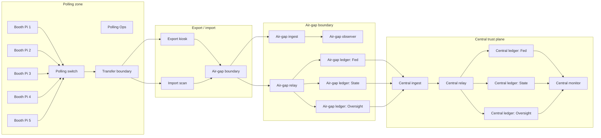

# Physical POC hardware plan (all-node physical demo)

This document captures a concrete, physical-only plan for a VoteChain demonstration where all protocol participants are separate devices on a demo board.

## Constraints for this plan

- All nodes are physical (no co-located containers/VMs).
- Goal is visibility for judges, operators, and auditors: every role is represented by a real box.
- Scope is Mode 1 / Mode 2 demo environments (in-person, institution-controlled nodes), not remote-only operation.
- Price estimates assume US sourcing and February 2026 market conditions; these vary significantly by supplier and lead time.

## Design principle

Split roles by trust boundary:

- Polling plane (voter-facing runtime and export path)
- Air-gap plane (ingest + relay + ledger quorum)
- Central plane (anchor write side + verification/monitoring)

Use separate physical boxes so demo presenters can point to each boundary and show explicit handoffs.

## Option A: Compact physical board (15-node, visible + stable)

This is the best option when you need many physical devices but still want controlled cost and setup time.

### Node roles

| Zone | Node | Quantity | Role |
|---|---|---:|---|
| Polling | `booth-pi-1..4` | 4 | Voter/session devices |
| Polling | `polling-ops` | 1 | Operator orchestration and local run logs |
| Transfer | `export-kiosk` | 1 | Egress signing + bundle handoff |
| Transfer | `import-scan` | 1 | Validation gateway before air-gap |
| Air-gap | `airgap-ingest` | 1 | Verifies and stores incoming bundle artifacts |
| Air-gap | `airgap-relay` | 1 | Relays to air-gap ledger and returns status |
| Air-gap | `airgap-ledger-node` | 1 | Ledger quorum simplification for compact demo (use 3-node quorum on full board below) |
| Central | `central-ingest` | 1 | Verifies, validates, and posts anchors |
| Central | `central-relay` | 1 | Pushes validated events to central trust plane |
| Central | `central-ledger-node` | 1 | Ledger quorum simplification (single service for compact board) |
| Central | `central-observer` | 1 | Monitoring/read-only status and evidence capture |

**Total: 15 nodes**

## Option B: Full-fidelity physical board (20-node, audit-ready)

Use this profile for maximum role separation and clearer alignment with quorum language in PRDs and assurance docs.

### Node roles

| Zone | Node | Quantity | Role |
|---|---|---:|---|
| Polling | `booth-pi-1..5` | 5 | Voter/session devices |
| Polling | `polling-ops` | 1 | Operator orchestration and local run logs |
| Transfer | `export-kiosk` | 1 | Egress signing + bundle handoff |
| Transfer | `import-scan` | 1 | Validation gateway before air-gap |
| Air-gap | `airgap-ingest` | 1 | Verifies and stores incoming bundle artifacts |
| Air-gap | `airgap-relay` | 1 | Relays to air-gap ledger and returns status |
| Air-gap | `airgap-observer` | 1 | Air-gap monitoring and integrity alerts |
| Air-gap | `airgap-ledger-federal` | 1 | Air-gap ledger quorum member |
| Air-gap | `airgap-ledger-state` | 1 | Air-gap ledger quorum member |
| Air-gap | `airgap-ledger-oversight` | 1 | Air-gap ledger quorum member |
| Central | `central-ingest` | 1 | Verifies, validates, and posts anchors |
| Central | `central-relay` | 1 | Pushes validated events to central trust plane |
| Central | `central-observer` | 1 | Monitoring/read-only status and evidence capture |
| Central | `central-ledger-federal` | 1 | Central ledger quorum member |
| Central | `central-ledger-state` | 1 | Central ledger quorum member |
| Central | `central-ledger-oversight` | 1 | Central ledger quorum member |
| Peripheral | boundary switch + hub inventory | 2 | VLAN and transfer boundaries |

**Total: 20 nodes + 2 managed switches**

## Board layout (physical view)

## Estimated hardware costs (USD, per-node and total)

> All estimates are approximate and should be treated as budget ranges, not procurement guarantees.

### Hardware profiles

| Profile | Typical unit spec | Per-node unit cost |
|---|---|---:|
| **Used / refurbished Raspberry Pi 4 or 5 class** | 4–8 GB RAM, SSD/fast micro-SD, active cooling | $90 – $220 |
| **New Raspberry Pi 5 class** | 8–16 GB RAM, SSD adapter, case, 12–24 V PSU | $140 – $280 |
| **Mini-PC (x86, N100/J4125 class)** | 8–16 GB RAM, NVMe SSD, 2.5/3.0 LAN | $180 – $360 |
| **Mini-PC premium (i5/N350/NUC class)** | 16+ GB RAM, NVMe SSD, fanless optional | $260 – $520 |

### Total ballpark (compute + power brick + storage per node)

| Scenario | Nodes | Refurb Pi | New Pi | Mini-PC | Mini-PC premium |
|---|---:|---:|---:|---:|---:|
| Compact board | 15 | $1,350 – $3,300 | $2,100 – $4,200 | $2,700 – $5,400 | $3,900 – $7,800 |
| Full-fidelity board | 20 | $1,800 – $4,400 | $2,800 – $5,600 | $3,600 – $7,200 | $5,200 – $10,400 |

### Non-node overhead

- Managed switch (VLAN capable): `$80 – $260` each (2x needed for clean demo routing)
- Cables + labels + management: `$150 – $450`
- Power distribution, surge strips, UPS: `$120 – $400`
- Enclosure/mounting + short-throw monitor/visuals: `$150 – $700`
- Optional peripherals (keyboard/mouse, spare SSD/network adapters): `$150 – $500`

**All-in physical build rough range**

- **Compact 15-node setup:** about **$2,600 – $6,500** total
- **Full 20-node setup:** about **$3,300 – $8,800** total

## What to buy first for a successful physical demo

1. Pick one hardware profile and keep it homogeneous for the board.
2. Build and smoke-test each box individually before interconnecting.
3. Use VLAN boundaries in the transfer switch to reinforce polling/air-gap/central story.
4. Keep one spare node in each plane for failover and live replacement during demos.

## Suggested placement on a demo table

- Left side: polling nodes and transfer boundary (most visible interaction area).
- Center-left: transfer scan + air-gap chain (highly visible trust-boundary handoff).
- Right-center: central trust plane and monitors.
- Far right: operator edge (single monitor + console + spare node).
- Keep uplinks short and label every cable (`BOOTH`, `AIRGAP`, `CENTRAL`, `MON`).

## Notes for the OSS repo

- Keep all generated secrets in `.env` files only; do not commit secrets.
- Keep node-specific notes in a demo runbook (compose profiles + startup order) rather than in PRD text.
- Track this document as the canonical baseline when we discuss physical budget and procurement for physical demo seasons.

