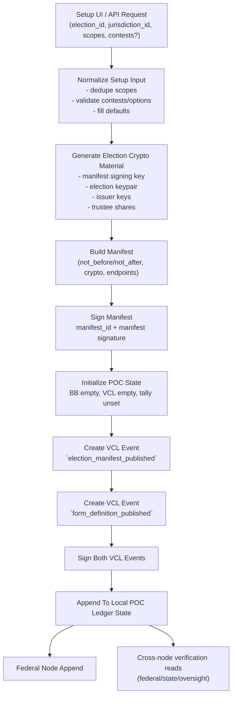

# VoteChain POC: Generic Setup and Ledger Anchoring

## Purpose

This document explains how a setup request (with arbitrary user-defined scopes) becomes a signed manifest plus a ledger-anchored form definition.

The setup model is intentionally scope-agnostic. A scope is just a string label such as:

- `local`
- `state`
- `federal`
- `college`
- `apartment`
- `mock`
- `district-7`

No protocol logic depends on special scope names.

## Setup Input Model

The setup API accepts:

- `election_id`
- `jurisdiction_id`
- `scopes[]` (free-form labels)
- `contests[]` (optional; if omitted, defaults are generated per scope)
- `voter_roll_size`
- `duration_days`

## Setup To Ledger Flow

## Event Payload

The setup process publishes two federal-originating setup events.

### `election_manifest_published`

- `election_id`
- `jurisdiction_id`
- `manifest_id`
- `signer_kid`
- `voter_roll_ceiling`
- `election_scopes` (the normalized user-provided scope labels)

### `form_definition_published`

- `election_id`
- `jurisdiction_id`
- `manifest_id`
- `form_definition_hash` (SHA-256 over canonical form-definition JSON)
- `form_definition` (canonical contest + option structure)
- `contest_count`

## Generic Scope Behavior

The system treats scope labels as metadata used for:

- contest grouping in setup and preview
- display context in ballot UX
- anchoring transparency in VCL payloads

The cryptographic and ledger flow remains identical regardless of scope label values.

## Builder Workflow

The setup UI now uses a quiz-style staged builder:

1. Define **Option Pools** first.
2. Add **Questions/Contests** by binding each question to one of those pools.
3. Run setup only after bindings validate.

This prevents free-text option entry at question-definition time.

## Per-Scope Options

Pools are typed and scope-aware:

- `Who` pools can bind only to `candidate` contests.
- `What` pools can bind only to `referendum` contests.
- Pool scope must be `Any Scope` or match the contest scope exactly.

## Result Isolation (No Cross-Binding)

- Ballot selections are stored by `contest_id` + option ID, not by generic labels.
- Setup guarantees unique `contest_id` values across the entire election bundle.
- Tally totals are computed per `contest_id`, so similarly named contests in different scopes remain isolated.
- Ballot validation enforces `election_id` and `manifest_id`, preventing cross-election mixing.

## Air-Gap Operator Flow

Use this flow when setup is authored offline and published online later:

1. On an air-gapped machine, use the setup builder to define scopes, option pools, and bound questions.
2. Run setup and click `Download Setup Package` to export:
   - `manifest_id`
   - `form_definition_hash`
   - signed setup events (`election_manifest_published`, `form_definition_published`)
3. Transfer artifacts via controlled media to the connected publication environment.
4. On the connected setup page, use `Publish Package To Ledger` with the exported package.
5. Verify cross-node visibility by reading each node ledger and checking:
   - matching `manifest_id`
   - matching `form_definition_hash`
   - valid event signatures and entry hashes
6. Start voting only after setup events are confirmed and consistent across nodes.

## Security Notes

- Manifest signature binds the final election setup to a key ID.
- Manifest and form-definition publications are event-signed and then replicated.
- The event chain remains append-only in the node ledger path.
- Setup resets prior local POC state to avoid mixed-election artifacts.
